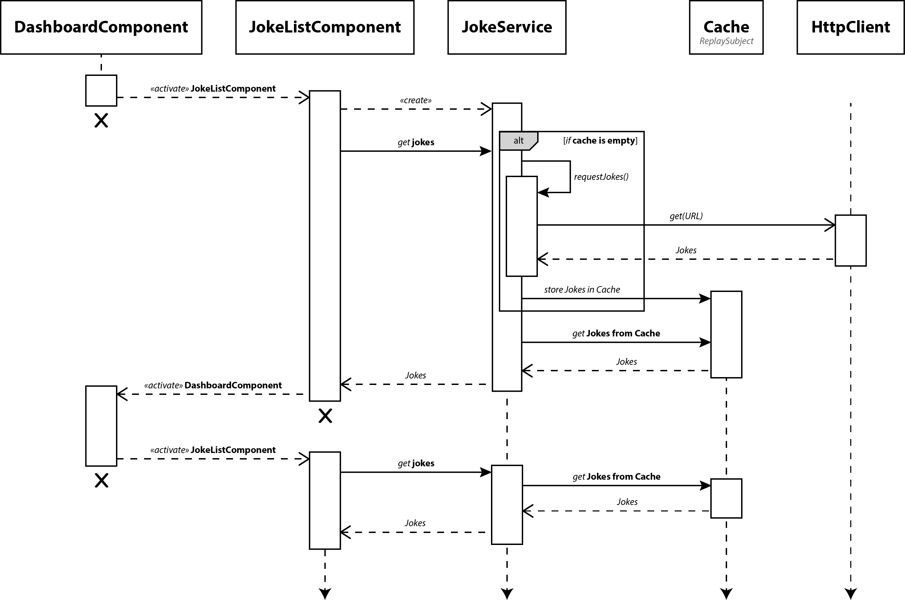
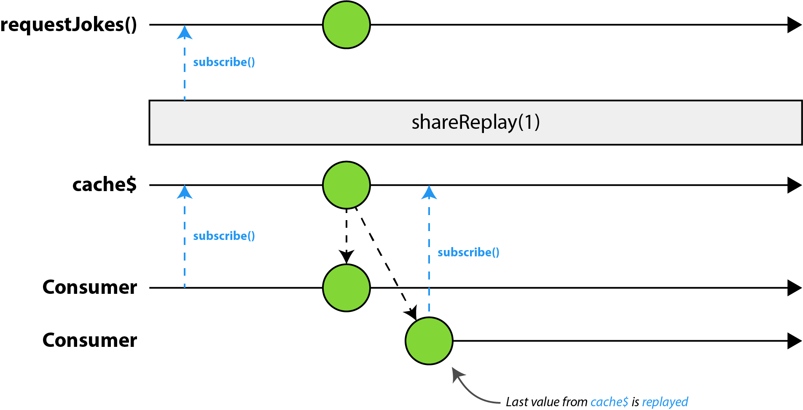
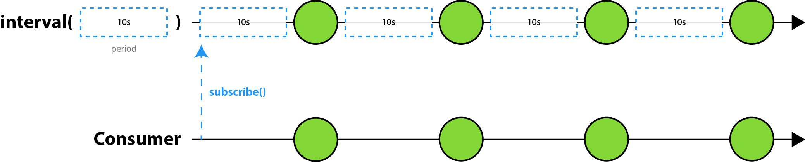
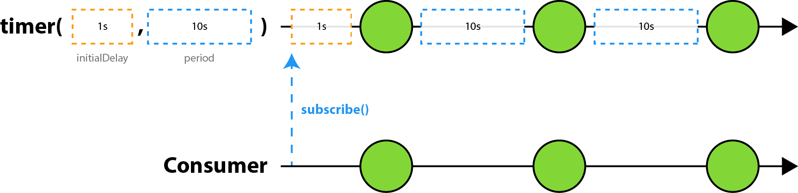
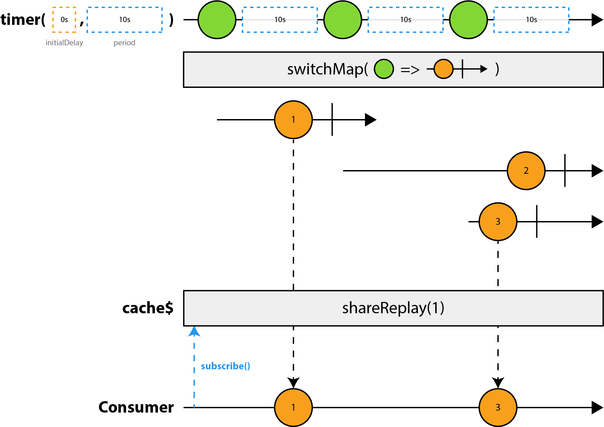
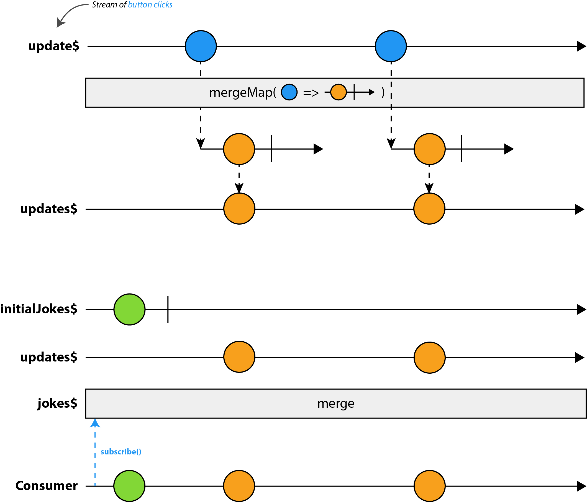

# [译] RxJS 高级缓存

> 原文链接: [https://blog.thoughtram.io/angular/2018/03/05/advanced-caching-with-rxjs.html](https://blog.thoughtram.io/angular/2018/03/05/advanced-caching-with-rxjs.html)

开发 Web 应用时，性能始终都是重中之重。要想提升 Angular 应用的速度，我们可以做一些工作，比如要摇树优化 (tree-shaking)、AoT (ahead-of-time)、模块的懒加载以及缓存。想要对 Angular 应用的性能提升的实战技巧有一个全面了解的话，我们强烈推荐你参考由 [Minko Gechev](https://twitter.com/mgechev) 撰写的 [Angular 性能检测表](https://github.com/mgechev/angular-performance-checklist#lazy-loading-of-resources)。在本文中，我们将专注于缓存。

实际上，缓存是提升网站用户体验的最有效的方式之一，尤其是当用户使用宽带受限的设备或网络环境较差。

缓存数据或资源的方式有很多种。静态资源通常都是由标准的浏览器缓存或 Service Workers 来进行缓存。虽然 Service Workers 也可以缓存 API 请求，但是对于图像、HTML、JS 或 CSS 文件等资源的缓存，它们通常更为有用。我们通常使用自定义机制来缓存应用的数据。

无论我们使用的是什么机制，缓存通常都是**提升应用的响应能力**、**减少网络花销**，并具有**内容在网络中断时可用**的优势。换句话说，当内容被缓存的更接近消费者时，比如在客户端，请求将不会导致额外的网络活动，并且可以更快速地检索缓存数据，从而节省了网络往返的整个过程。

在本文中，我们将使用 RxJS 和 Angular 提供的工具来开发一个高级缓存机制。

### 目录

  * [动机](#动机)
  * [需求](#需求)
  * [实现基础缓存](#实现基础缓存)
  * [自动更新](#自动更新)
  * [发送更新通知](#发送更新通知)
  * [按需拉取新数据](#按需拉取新数据)
  * [展望](#展望)
  * [特别鸣谢](#特别鸣谢)

## 动机

不时地就会有人问，如何在大量使用 Observables 的 Angular 应用中缓存数据？大多数人对于如何使用 Promises 来缓存数据有不错的理解，但当切换至响应式编程时，便会因为它的复杂度 (庞大的 API)、思维转化 (从命令式到声明式) 和众多概念而感到不知所措。因此，很难将一个基于 Promises 的现有缓存机制转换成基于 Observables 的，当你想要缓存机制变得更高级点时更是如此。

在 Angular 应用中通常使用 `HttpClientModule` 中的 `HttpClient` 来执行 HTTP 请求。`HttpClient` 的所有 API 都是基于 Observable 的，也就是说像 `get` 、`post` 、`put` 或 `delete` 等方法返回的都是 Observable 。因为 Observables 天生是惰性的，所以只有当我们调用 `subscribe` 时才会真正发起请求。但是，对同一个 Observable 调用多次 `subscribe` 会导致源 Observable 一遍又一遍地重新创建，每个订阅 (subscription) 上执行一个请求。我们称之为冷的 Observables 。

如果你对此完全没有概念的话，我们之前写过一篇此主题的文章: [冷的 vs 热的 Observables](https://blog.thoughtram.io/angular/2016/06/16/cold-vs-hot-observables.html) 。(译者注: 想了解冷的 vs 热的 Observables，还可以推荐阅读[这篇文章](./Hot-Vs-Cold-Observables.md))

这种行为将导致使用 Observables 来实现缓存机制变得很棘手。简单的方法往往就需要相当数量的样板代码, 我们可能会选择绕过 RxJS, 这也是可行的，但如果我们想要最终驾驭 Observables 的强大力量时，这种方式是不推荐的。说白了就是我们不想开配备小型摩托车引擎的法拉利，对吧？

## 需求

在深入代码之前，我们先来为要实现的高级缓存机制制定需求。

我们想要开发的应用名为笑话世界。这是一个简单的应用，它只是根据制定的分类来随机展示笑话。为了让应用更简单、更专注，我们只设定一个分类。

应用有三个组件: `AppComponent`、 `DashboardComponent` 和 `JokeListComponent` 。

`AppComponent` 组件是应用的入口，它渲染工具栏和 `<router-outlet>`，后者会根据当前路由器状态来填充内容。

`DashboardComponent` 组件只展示分类的列表。在这可以导航至 `JokeListComponent` 组件，它负责将笑话列表渲染到屏幕中。

笑话是使用 Angular 的 `HttpClient` 服务从服务器拉取的。要保持组件的职责单一和概念分离，我们想创建一个 `JokeService` 来负责请求数据。然后组件只需通过注入此服务便可以通过它的公有 API 来访问数据。

以上就是我们这个应用的架构，目前还没有涉及到缓存。

当从分类列表页导航至笑话列表页时，我们更倾向于请求缓存中的最新数据，而不是每次都向服务器发起请求。而缓存的底层数据会每10秒钟自动更新。

当然，对于生产级应用来说，每隔10秒轮询新数据并非是个好选择，一般来说会使用一种更成熟的方式来更新缓存 (例如 Web Socket 推送更新)。但在这里我们将保持简单性，以便于专注于缓存本身。

我们将会以某种形式来接收更新通知。对于这个应用来说，当缓存更新时，我们不想 UI (`JokeListComponent`) 中的数据自动更新，而是等待用户来执行 UI 的更新。为什么要这样做？想象一下，用户可能正在读某条笑话，然后突然间因为数据的自动更新这条笑话就消失了。这样的结果就是由于这种较差的用户体验，让用户很生气。因此，我们的做法是每当有新数据时提示用户更新。

为了更好玩一些，我们还想要用户能够强制缓存更新。这与仅更新 UI 不同，因为强制更新意味着从服务器请求最新数据、更新缓存，然后相应地更新 UI 。

来总结下我们将要开发的内容点:

  * 应用有两个组件 A 和 B，当从 A 导航至 B 时应该从缓存中请求 B 的数据，而不是每次都请求服务器
  * 缓存每隔10秒自动更新
  * UI 中的数据不会自动更新，而是需要用户执行更新操作
  * 用户可以强制更新，这将会发起 HTTP 请求以更新缓存和 UI

下面是应用的预览图:


## 实现基础缓存

我们先从简单的开始，然后一步步地打造出最终成熟的解决方案。

第一步是创建一个新的服务。

接下来，我们来添加两个接口，一个是描述 `Joke` 的数据结构，另一个是用来强化 HTTP 请求响应的类型。这会让 TypeScript 很开心，但最重要的是开发人员使用起来也更加方便和清晰。

```ts
export interface Joke {
  id: number;
  joke: string;
  categories: Array<string>;
}

export interface JokeResponse {
  type: string;
  value: Array<Joke>;
}
```

现在我们来实现 `JokeService` 。对于数据是来自缓存还是服务器，我们并不想暴露实现的细节，因此，我们只暴露一个 `jokes` 的属性，它返回的是包含笑话列表的 Observable 。

为了发起 HTTP 请求，我们需要确保在服务的构造函数中注入 `HttpClien` 服务。

下面是 `JokeService` 的框架:

```ts
import { Injectable } from '@angular/core';
import { HttpClient } from '@angular/common/http';

@Injectable()
export class JokeService {

  constructor(private http: HttpClient) { }

  get jokes() {
    ...
  }
}
```

接下来，我们将实现一个私有方法 `requestJokes()`，它会使用 `HttpClient` 来发起 `GET` 请求以获取笑话列表。

```ts
import { map } from 'rxjs/operators';

@Injectable()
export class JokeService {

  constructor(private http: HttpClient) { }

  get jokes() {
    ...
  }

  private requestJokes() {
    return this.http.get<JokeResponse>(API_ENDPOINT).pipe(
      map(response => response.value)
    );
  }
}
```

完成这一步后，我们只剩 `jokes` 的 getter 方法没有完成了。

一个简单的方法就是直接返回 `this.requestJokes()`，但这样并不会生效。从文章开头中我们已经得知 `HttpClient` 暴露出的所有方法，例如 `get` 返回的是冷的 Observables 。这意味着为每次订户都会重新发出整个数据流，从而导致多次的 HTTP 请求。毕竟，缓存的理念是提升应用的加载速度并将网络请求的数量限制到最小。

相反的，我们想让流变成热的。不仅如此，我们还想让每个新订阅者都接收到最新的缓存数据。有一个非常方便的操作符叫做 `shareReplay` 。它返回的 Observable 会共享底层数据源的单个订阅，在这里也就是 `this.requestJokes()` 所返回的 Observable 。

除此之外，`shareReplay` 还接收一个可选参数 `bufferSize`，对于我们这个案例它是相当便利的。`bufferSize` 决定了重放缓冲区的最大元素数量，也就是缓存和为每个新订阅者重放的元素数量。对于我们这个场景来说，我们只想要重放最新的一个至，所以 `bufferSize` 将设定为 1 。

我们来看下代码，并使用刚刚所学习到的知识:

```ts
import { Observable } from 'rxjs/Observable';
import { shareReplay, map } from 'rxjs/operators';

const API_ENDPOINT = 'https://api.icndb.com/jokes/random/5?limitTo=[nerdy]';
const CACHE_SIZE = 1;

@Injectable()
export class JokeService {
  private cache$: Observable<Array<Joke>>;

  constructor(private http: HttpClient) { }

  get jokes() {
    if (!this.cache$) {
      this.cache$ = this.requestJokes().pipe(
        shareReplay(CACHE_SIZE)
      );
    }

    return this.cache$;
  }

  private requestJokes() {
    return this.http.get<JokeResponse>(API_ENDPOINT).pipe(
      map(response => response.value)
    );
  }
}
```

Ok，上面代码中的大部分我们都已经讨论过了。但是等下，那个私有属性 `cache$` 和 getter 方法中的 `if` 语句是做什么的？答案很简单。如果直接返回 `this.requestJokes().pipe(shareReplay(CACHE_SIZE))` 的话，那么每次订阅都将创建一个缓存实例。但我们想要的是所有订阅者都共享同一个实例。因此，我们将这个共享的实例保存在私有属性 `cache$` 中，并在首次调用 getter 方法时对其进行初始化。后续的所有消费者都将共享此实例而无需每次都重新创建缓存。

通过下面的图来更直观地看下我们刚刚实现的内容:



在上图中，我们可以看到描述我们场景中所涉及到的对象的**序列图**，即请求笑话列表和在对象之间交换消息的队列。我们分解来看，以便更好地了解我们正在做什么。

我们从 `DashboardComponent` 导航至 `JokeListComponent` 开始说起。

组件初始化后 Angular 会调用 `ngOnInit` 生命周期钩子，这里我们将调用 `JokeService` 暴露的 `jokes` 的 getter 方法来请求笑话列表。因为这是首次请求数据，所以缓存本身还未初始化，也就是说 `JokeService.cache$` 是 `undefined` 。在内部我们会调用 `requestJokes()`，它会返回一个将会发出服务端数据的 Observable 。同时我们还应用了 `shareReplay` 操作符来获取预期效果。 

`shareReplay` 操作符会自动在原始数据源和所有后来的订阅者之间创建一个 `ReplaySubject` 。一旦订阅者的数量从 0 增加至 1，就会将 `Subject` 与底层源 Observable 进行连接，然后广播出它的所有重放值。后续的所有订阅者都将与中间人 `Subject` 进行连接，因此底层的冷的 Observable 只有一个订阅。这就是多播，它是我们这个简单缓存机制的基础。(译者注: 想深入了解多播，推荐[这篇文章](./Understanding-The-Publish-And-Share-Operators.md))

一旦服务端返回数据，数据就会被缓存。

注意，在序列图中 `Cache` 是一个独立的对象，它被表示成一个 `ReplaySubject`，它位于消费者 (订阅者) 和底层数据源 (HTTP 请求) 之间。

当再次为 `JokeListComponent` 组件请求数据时，缓存将会重放最新值并将其发送给消费者。这样就不会再发起额外的 HTTP 请求。

很简单，是吧？

要想了解更多细节，我们还需更进一步，来看看在 Observable 级别缓存是如何工作的。因此，我们将使用**弹珠图** (marble diagram) 来对流的工作原理进行可视化展示:



弹珠图看上去十分清晰，底层的 Observable 确实只有**一个订阅**，所有消费者订阅的都是这个共享 Observable，即 `ReplaySubject` 。我们还可以看到只有第一个订阅者触发了 HTTP 请求，而其他订阅者获得的只是缓存重放的最新值。

最后，我们来看看 `JokeListComponent` 以及如何展现数据。首先是注入 `JokeService` 。然后在 `ngOnInit` 生命周期中对 `jokes$` 属性进行初始化，初始值为由服务所暴露的 getter 方法所返回的 Observable， Observable 的类型为  `Array<Joke>`，这正是我们想要的数据。

```ts
@Component({
  ...
})
export class JokeListComponent implements OnInit {
  jokes$: Observable<Array<Joke>>;

  constructor(private jokeService: JokeService) { }

  ngOnInit() {
    this.jokes$ = this.jokeService.jokes;
  }

  ...
}
```

注意，我们并没有命令式地去订阅 `jokes$`，而是在模板中使用 `async` 管道，这样做是因为这个管道让人爱不释手。很好奇？可以参考这篇文章: [关于 AsyncPipe 你需要知道的三件事](https://blog.thoughtram.io/angular/2017/02/27/three-things-you-didnt-know-about-the-async-pipe.html)

```html
<mat-card *ngFor="let joke of jokes$ | async">...</mat-card>
```

酷！这就是我们的简单缓存了。想要验证请求是否只发起一次，可以打开 Chrome 的开发者工具，然后点击 Network 标签页并选择 XHR 。从分类列表页开始，导航至笑话列表页，然后再返回分类列表页，反反复复几次。

第 1 阶段在线 Demo: [点击查看](https://advanced-caching-with-rxjs-step-1.stackblitz.io) 。

## 自动更新

到目前为止，我们已经通过了少量的代码开发出了一个简单的缓存机制，大部分的脏活都是由 `shareReplay` 操作符完成的，它负责缓存和重放最新值。

目前完全可以正常运行，但是在后台的数据源却永远不会更新。如果数据可能每隔几分钟就发生变化怎么办？我们可不想强迫用户去刷新整个页面才能从服务器获得最新数据。

如果我们的缓存可以在后台每10秒更新一次岂不是很好？完全同意！作为用户，我们不必重新加载页面，如果数据发生变化的话，UI 会相应地更新。重申下，在真实的应用中我们基本上不会使用轮询，而是使用服务器推送通知。但对于我们这个小 Demo 应用来说，间隔 10 秒的定时器已经足够了。

实现起来也相当简单。总而言之，我们想要创建一个 Observable，它发出一系列根据给定时间间隔隔开的值，或者简单点说，我们想要每 x 毫秒就生成一个值。我们有几种实现方式。

第一种选择是使用 `interval` 。此操作符接收一个可选参数 `period`，它定义了每次发出值间的时间间隔。参考下面的示例:

```ts
import { interval } from 'rxjs/observable/interval';

interval(10000).subscribe(console.log);
```

这里我们设置的 Observable 会发出无限序列的整数，每次发出值会间隔 10 秒。也就是说第一个值将会在 10 秒发出。为了更好地演示，我们来看下 `interval` 操作符的弹珠图:



呃，果真如此。第一个值是“延迟”发出的，而这并非我们想要的效果。为什么这么说？因为如果我们从分类列表页导航至笑话列表页时，我们必须等待 10 秒后才会向服务器发起数据请求以渲染页面。

我们可以通过引入另一个名为 `startWith(value)` 的操作符来修复此问题，这样一开始就会先发出给定的 `value`，即初始值。但是，我们可以做的更好！

如果我告诉你还有另外一个操作符，它可以先根据给定的时间 (初始延迟) 发出值，然后再根据时间间隔 (常规的定时器) 来不停地发出值。`timer` 了解一下。

弹珠图时刻！



酷，但是它真的解决了我们问题了吗？是的，没错。如果我们将初始延迟设置为 **0**，并将时间间隔设置为 **10 秒**，这样它的行为就和 `interval(10000).pipe(startWith(0))` 是一样的，但却只使用了一个操作符。

我们来使用 `timer` 操作符并将其运用在我们现有的缓存机制当中。

我们需要设置一个定时器，然后每次时间一到就发起 HTTP 请求来从服务器拉取最新数据。也就是说，对于每个时间点我们都需要使用 `switchMap` 来切换成一个获取笑话列表的 Observable 。使用 `swtichMap` 有一个好的副作用就是可以避免条件竞争。这是由于这个操作符的本质，它会取消对前一个内部 Observable 的订阅，然后只发出最新内部 Observable 中的值。

我们缓存的其余部分都保持原样，我们的流仍然是多播的，所有的订阅者都共享同一个底层数据源。

同样的，`shareReplay` 会将最新值发送给现有的订阅者，并为后来的订阅者重放最新值。



正如在弹珠图中所展示的，`timer` 每 10 秒发出一个值。每个值都将转换成拉取数据的内部 Observable 。因为使用的是 `switchMap`，我们可以避免竞争条件，因此消费者只会收到值 `1` 和 `3` 。第二个内部 Observable 的值会被“跳过”，这是因为当新值发出时我们其实已经取消对它的订阅了。

下面来将我们刚刚所学到的应用到 `JokeService` 中:

```ts
import { timer } from 'rxjs/observable/timer';
import { switchMap, shareReplay } from 'rxjs/operators';

const REFRESH_INTERVAL = 10000;

@Injectable()
export class JokeService {
  private cache$: Observable<Array<Joke>>;

  constructor(private http: HttpClient) { }

  get jokes() {
    if (!this.cache$) {
      // 设置每 X 毫秒发出值的定时器
      const timer$ = timer(0, REFRESH_INTERVAL);

      // 每个时间点都会发起 HTTP 请求来获取最新数据
      this.cache$ = timer$.pipe(
        switchMap(_ => this.requestJokes()),
        shareReplay(CACHE_SIZE)
      );
    }

    return this.cache$;
  }

  ...
}
```

酷！是否想自己试试呢？经常尝试下面的在线 Demo 吧。从分类列表页导航至笑话列表页，然后见证奇迹的诞生。耐心等待几秒后就能看见数据更新了。记住，虽然缓存是每 **10 秒**刷新一次，但你可以在在线 Demo 中自由更改 `REFRESH_INTERVAL` 的值。

第 2 阶段在线 Demo: [点击查看](https://advanced-caching-with-rxjs-step-2.stackblitz.io)。

## 发送更新通知

我们来简单回顾下到目前为止我们所开发的内容。

当从 `JokeService` 请求数据时，我们总是希望请求缓存中的最新数据，而不是每次都请求服务器。缓存的底层数据每隔 10 秒刷新一次，数据传播到组件后将使得 UI 自动更新。

这是有些失败的。想象一下，我们就是用户，当我们正在看某条笑话时突然笑话就消失了，这是因为 UI 自动更新了。这种糟糕的用户体验会让用户很生气。

因此，当有新数据时应该发通知提醒用户。换句话说，我们想让用户来执行 UI 的更新操作。

事实上，要完成此功能我们都不需要去修改服务层。逻辑相当简单。毕竟，我们的服务层不应该关心发送通知以及何时、如何去更新屏幕上的数据，这些都应该是由视图层来负责。

首先，我们需要由**初始值**来展示给用户，否则, 在第一次更新缓存之前, 屏幕将是空白的。我们马上就会明白这样做的原因。设置初始值的流就像调用 getter 方法那样简单。此外，因为我们只对首个值感兴趣，所以我们可以使用 `take` 操作符。

为了让逻辑可以复用，我们创建一个辅助方法 `getDataOnce()` 。

```ts
import { take } from 'rxjs/operators';

@Component({
  ...
})
export class JokeListComponent implements OnInit {
  ...
  ngOnInit() {
    const initialJokes$ = this.getDataOnce();
    ...
  }

  getDataOnce() {
    return this.jokeService.jokes.pipe(take(1));
  }
  ...
}
```

根据需求，我们只想在用户真正执行更新时才更新 UI，而不是自动更新。那么用户如何实施你所要求的更新呢？当我们单击 UI 中表示“更新”的按钮时, 才会执行此操作。暂时，我们不必考虑通知，而应该专注于点击按钮时的更新逻辑。

要完成此功能，我们需要一种方式来创建来源于 DOM 事件的 Observable，在这里指按钮的点击事件。创建的方式有好几种，但最常用的是使用 `Subject` 作为模板和组件类中逻辑之间的**桥梁**。简而言之，`Subject` 是一种同时实现 `Observer` (观察者) 和 `Observable` 的类型。Observables 定义了数据流并生成数据，而观察者可以订阅 Observables 并接收数据。

Subject 好的方面是我们可以直接在模板使用事件绑定，然后当事件触发时调用 `next` 方法。这会将特定值广播给所有正在监听值的观察者们。注意，如果 Subject 的类型为 `void` 的话，我们还可以省略该值。事实上，这正是我们的实际场景。

我们来实例化一个新的 Subject 。

```ts
import { Subject } from 'rxjs/Subject';

@Component({
  ...
})
export class JokeListComponent implements OnInit {
  update$ = new Subject<void>();
  ...
}
```

之后我们就可以在模板中来使用它。

```html
<div class="notification">
  <span>There's new data available. Click to reload the data.</span>
  <button mat-raised-button color="accent" (click)="update$.next()">
    <div class="flex-row">
      <mat-icon>cached</mat-icon>
      UPDATE
    </div>
  </button>
</div>
```

来看下我们是如何使用**事件绑定**语法来捕获 `<button>` 上的点击事件的？当点击按钮时，我们只是传播一个幽灵值从而通知所有活动的观察者。我们称之为幽灵值是因为实际上并没有传任何值，或者说传递的值的类型为 `void` 。

另一种方式是使用 `@ViewChild()` 装饰器和 RxJS 的 `fromEvent` 操作符。但是，这需要我们在组件类中“混入” DOM 并从视图中查询 HTML 元素。使用 Subject 的话，我们只需要将两者桥接即可，除了我们在按钮上添加的事件绑定之外，根本不会触及 DOM 。

好了，设置好视图后，我们就可以切换至处理 UI 更新的逻辑了。

那么更新 UI 意味着什么？缓存是在后台自动更新的，而我们想要点击按钮时才渲染从缓存中拿到的最新值，是这样吧？这意味着我们的**源头**流是 Subject 。每次 `update$` 上发出值时，我们就将其**映射**成给出最新缓存值的 Observable 。换句话说，我们使用的是 **高阶 Observable ( Higher Order Observable )** ，即发出 Observables 的 Observable 。

在此之前，我们应该知道 `switchMap` 正好可以解决这种问题。但这次，我们将使用 `mergeMap` 。它的行为与 `switchMap` 很类似，它不会取消前一个内部 Observable 的订阅，而是将内部 Observable 的发出值合并到输出 Observable 中。

事实，从缓存中请求最新值时，HTTP 请求早已完成，缓存也已经成功更新。因此，我们并不会面临条件竞争的问题。虽然这看上去还是异步的，但某种程度上来说，它其实是**同步的**，因为值是在同一个 tick 中发出的。

```ts
import { Subject } from 'rxjs/Subject';
import { mergeMap } from 'rxjs/operators';

@Component({
  ...
})
export class JokeListComponent implements OnInit {
  update$ = new Subject<void>();
  ...

  ngOnInit() {
    ...
    const updates$ = this.update$.pipe(
      mergeMap(() => this.getDataOnce())
    );
    ...
  }
  ...
}
```

酷！每次“更新”时我们都是从缓存中请求的最新值，而缓存使用的是我们之前实现的辅助方法。

到这里，还差一小步就可以完成负责将笑话渲染到屏幕上的流。我们所需要做的只是合并 `initialJokes$` 和 `update$` 这两个流。

```ts
import { Observable } from 'rxjs/Observable';
import { Subject } from 'rxjs/Subject';
import { merge } from 'rxjs/observable/merge';
import { mergeMap } from 'rxjs/operators';

@Component({
  ...
})
export class JokeListComponent implements OnInit {
  jokes$: Observable<Array<Joke>>;
  update$ = new Subject<void>();
  ...

  ngOnInit() {
    const initialJokes$ = this.getDataOnce();

    const updates$ = this.update$.pipe(
      mergeMap(() => this.getDataOnce())
    );

    this.jokes$ = merge(initialJokes$, updates$);
    ...
  }
  ...
}
```

我们使用辅助方法 `getDataOnce()` 来将每次更新事件映射成最新的缓存值，这点很重要。回想一下，在这个方法内部使用了 `take(1)`，它只取第一个值然后就**完成**流。这是至关重要的，否则最终得到的是一个正在进行中或实时连接到缓存的流。在这种情况下，基本上会破坏我们仅通过点击“更新”按钮来执行 UI 更新的逻辑。

还有，因为底层的缓存是多播的，永远都重新订阅缓存以获取最新值是完全安全的。

在继续完成通知流之前，我们先暂停下来看看刚刚实现逻辑的弹珠图。



正如在图中所看到的，`initialJokes$` 很关键，因为如果没有它的话我们只能在点击“更新”按钮后才能看到屏幕上的笑话列表。虽然数据在后台每 10 秒更新一次，但我们根本无法点击更新按钮。因为按钮本身也是通知的一部分，但我们却一直没有将其展示给用户。

那么，让我们填补这个空白并实现缺失的功能。

我们需要创建一个 Observable 来负责显示/隐藏通知。从本质上来说，我们需要一个发出 `true` 或 `false` 的流。当更新时，我们想要的值是 `true`，当用户点击“更新”按钮时，我们想要的值是 `false` 。

此外，我们还想要**跳过**缓存发出的首个(初始)值，因为它并不是新数据。

如果使用流的思维，我们可以将其拆分为多个流，然后再将它们**合并**成单个的 Observable 。最终的流将具备显示或隐藏通知的所需行为。

理论到此为止！下面来看代码:

```ts
import { Observable } from 'rxjs/Observable';
import { Subject } from 'rxjs/Subject';
import { skip, mapTo } from 'rxjs/operators';

@Component({
  ...
})
export class JokeListComponent implements OnInit {
  showNotification$: Observable<boolean>;
  update$ = new Subject<void>();
  ...

  ngOnInit() {
    ...
    const initialNotifications$ = this.jokeService.jokes.pipe(skip(1));
    const show$ = initialNotifications$.pipe(mapTo(true));
    const hide$ = this.update$.pipe(mapTo(false));
    this.showNotification$ = merge(show$, hide$);
  }
  ...
}
```

这里，我们跳过了缓存的第一个值，然后监听它剩下所有的值，这样做的原因是第一个值不是新数据。我们将 `initialNotifications$` 发出的每个值都映射成 `true` 以显示通知。一旦我们点击通知里的“更新”按钮，`update$` 就会产生一个值，我们可以将这个值映射成 `false` 以关闭通知。

我们在 `JokeListComponent` 组件的模板中使用 `showNotification$` 来切换 class 以显示/关闭通知。

```html
<div class="notification" [class.visible]="showNotification$ | async">
  ...
</div>
```

耶！目前，我们已经十分接近最终的解决方案了。在继续前进之前，我们来试玩下在线 Demo 。不用着急，再来一步步地过遍代码。

第 3 阶段在线 Demo: [点击查看](https://advanced-caching-with-rxjs-step-3.stackblitz.io)。

## 按需拉取新数据

酷！一路走来我们已经为我们的缓存实现了一些很酷的功能。要结束本文并将缓存再提升一个等级的话，我们还需要做一件事。作为用户，我们想要能够在任何时间点来**强制**更新数据。

这并没有什么复杂的，但要完成此功能我们需要同时修改组件和服务。

我们先从服务开始。我们需要一个面向公众的 API 来强制缓存重载数据。从技术上来说，我们会**完成**当前缓存，并将其设置为 `null` 。这意味着下次我们从服务中请求数据时会设置一个新的缓存，它会从服务器拉取数据并保存起来以便为后来的订阅者服务。每次强制更新时创建一个新缓存并不是什么大问题，因为旧的缓存将会完成并最终被垃圾收集。实际上，这样做还有一个有用的副作用，就是**重置**了定时器，这决定是我们想得到的效果。比如说，我们等待 9 秒后点击“强制更新”按钮。我们所期望的数据刷新了，但我们不想看到 1 秒后弹出更新通知。我们想要让计时器重新开始，这样当强制更新后再过 10 秒才应该触发**自动更新**。

销毁缓存的另一个原因是相比于不销毁缓存的版本，它的复杂度要小得多。如果是后者的话，缓存需要知道重载数据是否是强制执行的。

我们来创建一个 Subject，它用来通知缓存以完成。这里我们利用了 `takeUnitl` 操作符并将其加入到 `cache$` 流中。此外，我们还实现了一个公开的 API ，它使用 Subject 来广播事件，同时将缓存设置为 `null` 。

```ts
import { Subject } from 'rxjs/Subject';
import { timer } from 'rxjs/observable/timer';
import { switchMap, shareReplay, map, takeUntil } from 'rxjs/operators';

const REFRESH_INTERVAL = 10000;

@Injectable()
export class JokeService {
  private reload$ = new Subject<void>();
  ...

  get jokes() {
    if (!this.cache$) {
      const timer$ = timer(0, REFRESH_INTERVAL);

      this.cache$ = timer$.pipe(
        switchMap(() => this.requestJokes()),
        takeUntil(this.reload$),
        shareReplay(CACHE_SIZE)
      );
    }

    return this.cache$;
  }

  forceReload() {
    // 调用 `next` 以完成当前缓存流
    this.reload$.next();

    // 将缓存设置为 `null`，这样下次调用 `jokes` 时
    // 就会创建一个新的缓存
    this.cache$ = null;
  }

  ...
}
```

光在服务中实现并没有什么作用，我们还需要在 `JokeListComponent` 中来使用它。为此，我们将实现一个函数 `forceReload()`，当点击“强制更新”按钮时会调用此函数。此外，我们还需要创建一个 Subject 作为事件总线 ( Event Bus )，用于更新 UI 以及显示通知。我们很快就会看到它的作用。

```ts
import { Subject } from 'rxjs/Subject';

@Component({
  ...
})
export class JokeListComponent implements OnInit {
  forceReload$ = new Subject<void>();
  ...

  forceReload() {
    this.jokeService.forceReload();
    this.forceReload$.next();
  }
  ...
}
```

这样我们就可以将 `JokeListComponent` 模板中按钮联系起来，以强制缓存重新加载数据。我们需要做的只是使用 Angular 的事件绑定语法来监听 `click` 事件，当点击按钮时调用 `forceReload()` 。

```html
<button class="reload-button" (click)="forceReload()" mat-raised-button color="accent">
  <div class="flex-row">
    <mat-icon>cached</mat-icon>
    FETCH NEW JOKES
  </div>
</button>
```

这样已经可以工作了，但前提是我们先返回到分类列表页，然后再回到笑话列表页。这肯定不是我们想要的结果。当强制缓存重载数据时我们希望能**立即**更新 UI 。 

还记得我们已经实现好的流 `update$` 吗？当我们点击“更新”按钮时，它会请求缓存中的最新数据。事实上，我们需要的也是同样的行为，因此我们可以继续使用并扩展此流。这意味着我们需要**合并** `update$` 和 `forceReload$`，因为这两个流都是 UI 更新的数据源。

```ts
import { Subject } from 'rxjs/Subject';
import { merge } from 'rxjs/observable/merge';
import { mergeMap } from 'rxjs/operators';

@Component({
  ...
})
export class JokeListComponent implements OnInit {
  update$ = new Subject<void>();
  forceReload$ = new Subject<void>();
  ...

  ngOnInit() {
    ...
    const updates$ = merge(this.update$, this.forceReload$).pipe(
      mergeMap(() => this.getDataOnce())
    );
    ...
  }
  ...
}
```

就是这么简单，难道不是吗？是的，但还没有结束。实际上，我们这样做只会“破坏”通知。在我们点击“强制更新”按钮之前，一切都是好用的。一旦点击按钮后，屏幕和缓存中的数据依旧照常更新，但当等待了 10 秒后却并没有通知弹出。问题在于强制更新将会完成缓存流，这意味着在组件中不会再接收到值。通知流 ( `initialNotifications$` ) 基本就是死掉了。这不是正确的结果，那么我们如何来修复它呢？

相当简单！我们监听 `forceReload$` 发出的事件，将其每个发出的值都切换成一个新的通知流。这里**取消**对**前一个**流的订阅很重要。耳边是否回荡起铃声？就好像在告诉我们这里需要使用 `switchMap` 。

我们来动手实现代码！

```ts
import { Observable } from 'rxjs/Observable';
import { Subject } from 'rxjs/Subject';
import { merge } from 'rxjs/observable/merge';
import { take, switchMap, mergeMap, skip, mapTo } from 'rxjs/operators';

@Component({
  ...
})
export class JokeListComponent implements OnInit {
  showNotification$: Observable<boolean>;
  update$ = new Subject<void>();
  forceReload$ = new Subject<void>();
  ...

  ngOnInit() {
    ...
    const reload$ = this.forceReload$.pipe(switchMap(() => this.getNotifications()));
    const initialNotifications$ = this.getNotifications();
    const show$ = merge(initialNotifications$, reload$).pipe(mapTo(true));
    const hide$ = this.update$.pipe(mapTo(false));
    this.showNotification$ = merge(show$, hide$);
  }

  getNotifications() {
    return this.jokeService.jokes.pipe(skip(1));
  }
  ...
}
```

就这样。每当 `forceReload$` 发出值，我们就取消对前一个 Observable 的订阅，然后切换成一个全新的通知流。注意，这里有一行代码我们需要调用两次，就是 `this.jokeService.jokes.pipe(skip(1))` 。为了避免重复，我们创建了函数 `getNotifications()`，它返回笑话列表的流，但会跳过第一个值。最后，我们将 `initialNotifications$` 和 `reload$` 合并成一个名为 `show$` 的流。这个流负责在屏幕上显示通知。另外没有必要取消 `initialNotifications$` 的订阅，因为它会在缓存重新创建之前完成。其余的都保持不变。

嗯，我们做到了。我们来花点时间看看我们刚刚实现内容的弹珠图。


正如在图中所看见的，对于显示通知来说，`initialNotifications$` 十分重要。如果没有这个流的话，我们只能在强制缓存更新后才有机会看到通知。也就是说，当我们按需请求最新数据时，我们必须不断地切换成新的通知流，因为前一个(旧的) Observable 已经完成并不再发出任何值。

就是这样！我们使用 RxJS 和 Angular 提供的工具实现了一个复杂的缓存机制。简答回顾下，我们的服务暴露出一个流，它为我们提供笑话列表。每隔 10 秒会触发 HTTP 请求来更新缓存。为了提升用户体验，我们提供了更新通知，这样用户可以执行更新 UI 的操作。在此之上，我们还为用户提供了一种按需请求最新数据的方式。

太棒了！这就是完整的解决方案。花费几分钟再来看一遍代码。然后尝试不同的场景以确认是否一切都能正常运行。

第 4 阶段在线 Demo: [点击查看](https://advanced-caching-with-rxjs-step-4.stackblitz.io)。

## 展望

如果你稍后想要做些课后作业或开发脑力的话，这有几点改进想法:

  * 添加错误处理
  * 将逻辑从组件中重构至服务中，以使其可复用

## 特别鸣谢

特别感谢 [Kwinten Pisman](https://twitter.com/KwintenP) 帮助我完成代码的编写。我还要感谢 [Ben Lesh](https://twitter.com/BenLesh) 和 [Brian Troncone](https://twitter.com/BTroncone) 给予我有价值的反馈和提出一些改进点。此外，还要非常感谢 [Christoph Burgdorf](https://twitter.com/cburgdorf) 对于文章和代码的审查。
