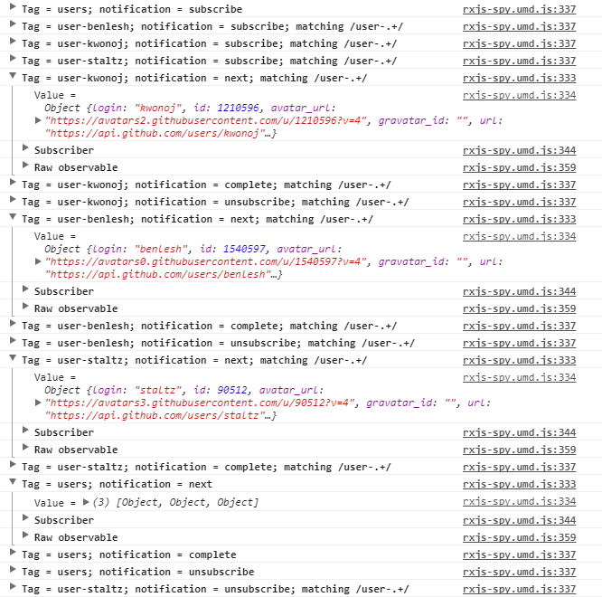
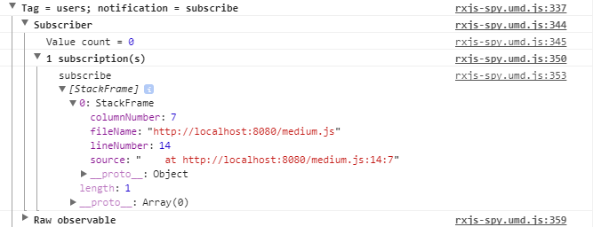
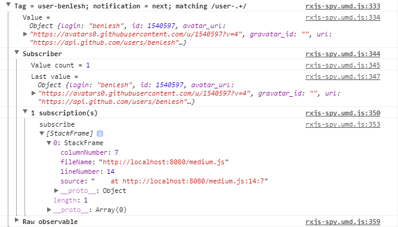
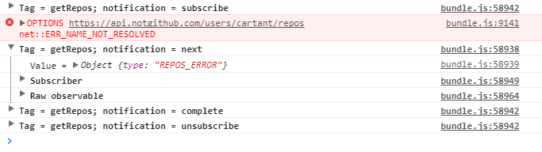
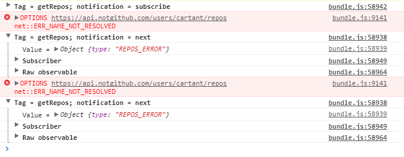

# [译] 调试 RxJS 第2部分: 日志篇

> 原文链接: [https://blog.angularindepth.com/debugging-rxjs-part-2-logging-56904459f144](https://blog.angularindepth.com/debugging-rxjs-part-2-logging-56904459f144)


日志没什么可兴奋的。

然而，日志是获取足够信息以开始推断问题的直接方式，它不是靠猜的，而且它通常用于调试 RxJS 代码。

本文是调试 RxJS 系列文章的第二篇，继 [调试 RxJS 第1部分: 工具篇](./Debugging-RxJS-Part1-Tooling.md)之后，侧重于使用日志来解决实际问题。在本文中，我将展示如何以一种不唐突的方式来使用 `rxjs-spy` 获取详情和有针对性的信息。

来看一个简单示例，示例中使用的是 `rxjs` 和 `rxjs-spy` 的 UMD bundles:

```javascript
RxSpy.spy();
RxSpy.log(/user-.+/);
RxSpy.log('users');

const names = ['benlesh', 'kwonoj', 'staltz'];
const users = Rx.Observable.forkJoin(...names.map(name =>
  Rx.Observable
    .ajax
    .getJSON(`https://api.github.com/users/${name}`)
    .tag(`user-${name}`)
))
.tag('users');

users.subscribe();
```

示例中使用 `forkJoin` 来组成一个发出 GitHub 用户数组的 observable 。

`rxjs-spy` 对使用 `tag` 操作符标记过的 observables 起作用，`tag` 操作符使用字符串标签名来注释 observable，仅此而已。在组成 observable 之前，示例启用了侦察，并为匹配 `/user-.+/` 正则表达式或标签名为 `users` 的 observable 配置日志记录器。

示例的输入看上去应该是这样的:



除了 observable 的 `next` 和 `complete` 通知，日志输出还包括了订阅和取消订阅的通知。它显示了所发生的一切：

  * 订阅组合 observable 会并行订阅每个用户 API 请求的 observable
  * 请求完成的顺序是不固定的
  * observables 全部完成
  * 全部完成后，组合 observable 的订阅会自动取消订阅

每个日志中的通知都包含接收该通知的订阅者 ( Subscriber )的信息，其中包括订阅者订阅的数量和 `subscribe` 调用的堆栈跟踪:



堆栈跟踪指向的是根源的 `subscribe` 调用，也就是 observable 订阅者的显式订阅。所以，用户请求 observables 的堆栈跟踪也指向 `medium.js` (译者注: 即上面的代码文件) 中的 `subscribe` 调用:



当调试时，我发现知道实际的 `subscribe` 调用地点比知道位于组合 observable 中间的 `subscribe` 调用地点更有用。

现在我们来看一个现实问题。

当编写 [`redux-observable`](https://github.com/redux-observable/redux-observable) 的 epics 或 `ngrx` 的 [effects](https://github.com/ngrx/effects) 时，我见过一些开发者的代码大概是这样的:

```typescript
import { Observable } from 'rxjs/Observable';
import { ajax } from 'rxjs/observable/dom/ajax';

const getRepos = action$ =>
  action$.ofType('REPOS_REQUEST')
    .map(action => action.payload.user)
    .switchMap(user => ajax.getJSON(`https://api.notgithub.com/users/${user}/repos`))
    .map(repos => { type: 'REPOS_RESPONSE', payload: { repos } })
    .catch(error => Observable.of({ type: 'REPOS_ERROR' }))
    .tag('getRepos');
```

乍看上去没什么问题，而且大多数情况下也能正常运行。这种 bug 还是在单元测试里发现不了的。

问题就是有时候 epic 就会停止运行。再具体一点就是当 dispatch 了报错的 action 后它会停止运行。

日志显示了具体发生了什么:



发出报错的 action 后， observable 便完成了，因为 `redux-observable` 的基础设施取消了 epic 的订阅。`catch` 操作符的[文档](http://reactivex.io/rxjs/class/es6/Observable.js~Observable.html#instance-method-catch)解释了这一现象发生的原因:

> _无论 `selector` 函数返回的 observable 是什么，都会被用来继续执行 observable 链。_

在 epic 中，`catch` 返回的 observable 完成了，epic 也就完成了。

解决方法是将 `map` 和 `catch` 的调用移到 `switchMap` 里面，就像这样:

```typescript
import { Observable } from 'rxjs/Observable';
import { ajax } from 'rxjs/observable/dom/ajax';

const getRepos = action$ =>
  action$.ofType('REPOS_REQUEST')
    .map(action => action.payload.user)
    .switchMap(user => ajax
      .getJSON(`https://api.notgithub.com/users/${user}/repos`)
      .map(repos => { type: 'REPOS_RESPONSE', payload: { repos } })
      .catch(error => Observable.of({ type: 'REPOS_ERROR' }))
    )
    .tag('getRepos');
```

这样 epic 便不会完成，它会继续 dispatch 报错的 actions:



在这两个示例中，对于被调试的代码来说，唯一需要修改就是是添加了某个标记注释。

注释是轻量级的，只需添加一次，我倾向于将它们留在代码中。`tag` 操作符的使用可以独立于 `rxjs-spy` 中诊断功能，通过使用 `rxjs-spy/add/operator/tag` 或直接从 `rxjs-spy/operator/tag ` 导入。所以保留标签的成本很小。

日志记录器可以使用正则表达式来配置，这会导致了多种可能性的标记。例如，使用像 `github/users` 和 `github/repos` 这样的复合标签就可以让所有标记名以 `github` 开头的 observables 启用日志。

日志没什么可兴奋的，但是从日志的输出中收集到的信息通常可以节省大量的时间。采用灵活的标记方法可以进一步减少处理日志相关代码的时间。