# [译] RxJS: 使用超直观的交互图来学习组合操作符

> 原文链接: [https://blog.angularindepth.com/learn-to-combine-rxjs-sequences-with-super-intuitive-interactive-diagrams-20fce8e6511](https://blog.angularindepth.com/learn-to-combine-rxjs-sequences-with-super-intuitive-interactive-diagrams-20fce8e6511)

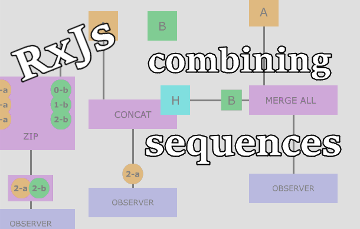

在开发复杂度相当高的应用时，通常数据源都不止一个。这些数据源可能是多个像 Firebase 这样的外部数据点，也可能是若干个用户与之交互的 UI 组件。序列组合 ( sequence composition ) 是一项可以让你跨多个数据源来创建复杂查询的技术，它是通过将这些相关的多个数据流组合成单个数据流来实现的。RxJS 提供了各式各样的操作符来帮助你完成此项任务，在本文中我们将介绍一些最常用的操作符。

在本文的写作过程中，为了更好地展现出所有操作符之间的区别，我设计创造了一些超级直观的数据流动图，这让我几乎成为了一名兼职的专业动画师。但是，所有图表都是以 GIF 动图的形式嵌入到本文中的，所以需要一点时间才能全部加载出来。还请耐心等待。

在本文出现的代码中，我都将使用 pipeable 操作符，如果不熟悉的话，可以[点击这里查看](https://github.com/RxJS-CN/RxJS-Docs-CN/blob/master/doc/pipeable-operators.md)。我还会使用一个自定义的 `stream` 操作符，它会以订阅时传入的第一个参数作为名称来异步地生成不断发出值的流。

下面是本文中用到的图表类型的说明:

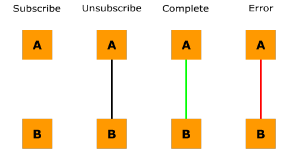

## 并发地合并多个流

我们第一个要介绍的操作符就是 **merge** 。此操作符可以组合若干个流，然后并发地发出每个输入流中的所有值。一旦输入流中产生了值，这些值会作为结果流的一部分而被发出。这种过程在文档中通常被称之为打平 ( flattening ) 。

当所有输入流完成时，结果流就会完成，如何任意输入流报错，那么结果流就会报错。如果某个输入流没有完成的话，那么结果流便不会完成。

如果你只是对来自多个流中所有的值感兴趣，就好像它们是由一个流所产生的，而不关心值发出的顺序，那么请使用 `merge` 操作符。

在下面的动图中，可以看到 `merge` 操作符组合了两个流 `A` 和 `B` ，这两个流各自生成 3 个值，每当发出值时值便会传递到结果流中。

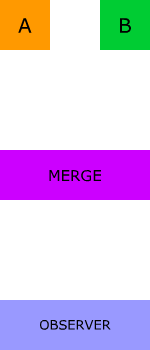

下面是与动图配套的代码示例:

```js
const a = stream('a', 200, 3, 'partial');
const b = stream('b', 200, 3, 'partial');
merge(a, b).subscribe(fullObserver('merge'));
// 还可以使用实例操作符
// a.pipe(merge(b)).subscribe(fullObserver('merge'));
```

可编辑的 stackblitz 在线 demo: [https://combining-sequences-merge.stackblitz.io](https://combining-sequences-merge.stackblitz.io)

## 顺序地连接多个流

接下来要介绍的操作符是 **concat** 。它按顺序订阅每个输入流并发出其中所有的值，同一时间只会存在一个订阅。只有当前输入流完成的情况下才会去订阅下一个输入流并将其值传递给结果流。

当所有输入流完成时，结果流就会完成，如何任意输入流报错，那么结果流就会报错。如果某个输入流没有完成的话，那么结果流便不会完成，这意味着某些流永远都不会被订阅。

如果值发出的顺序很重要，并且你想要传给操作符的第一个输入流先发出值的话，那么请使用 `concat` 操作符。举个例子，有两个流，一个从缓存中获取值，一个从远程服务器获取值。如果你想要将两者组合起来并确保缓存中的值先发出的话，就可以使用 `concat` 。

在下面的动图中，可以看到 `concat` 操作符组合了两个流 `A` 和 `B` ，这两个流各自生成 3 个值，先是 `A` 发出的值传递到结果流，然后才是 `B` 。

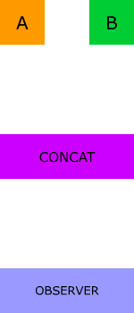

下面是与动图配套的代码示例:

```js
const a = stream('a', 200, 3, 'partial');
const b = stream('b', 200, 3, 'partial');
concat(a, b).subscribe(fullObserver('concat'));
// 还可以使用实例操作符
// a.pipe(concat(b)).subscribe(fullObserver(‘concat’));
```

可编辑的 stackblitz 在线 demo: [https://concat.stackblitz.io](https://concat.stackblitz.io)

## 让多个流竞争

接下来要介绍的操作符 **race** 引入了一个相当有趣的概念。它本身并对流进行任何组合，而是选择第一个产生值的流。一旦第一个流发出值后，其他的流就会被取消订阅，完全忽略掉。

当被选中的流完成时，结果流也随之完成，如果被选中的流报错，那么结果流也将报错。同样，如果被选中的流不完成，那么结果流便永远不会完成。

如果有多个提供值的流时此操作符会非常有用，举个例子，某个产品的服务器遍布世界各地，但由于网络条件，延迟是不可预测的，并且差异巨大。使用 `race` 的话，可以向多个数据源发送同样的请求，随后消费首个响应请求的结果。

在下面的动图中，可以看到 `race` 操作符组合了两个流 `A` 和 `B` ，这两个流各自生成 3 个值，但只有 `A` 的值被发出了，因为它首先发出了值。

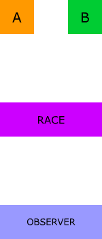

下面是与动图配套的代码示例:

```js
const a = intervalProducer(‘a’, 200, 3, ‘partial’);
const b = intervalProducer(‘b’, 500, 3, ‘partial’);
race(a, b).subscribe(fullObserver(‘race’));
// 还可以使用实例操作符
// a.pipe(race(b)).subscribe(fullObserver(‘race’));
```

可编辑的 stackblitz 在线 demo: [https://combining-sequences-race-b-is-ignored.stackblitz.io](https://combining-sequences-race-b-is-ignored.stackblitz.io)

## 使用高阶 observables 来组合未知数量的流

之前介绍过的操作符，无论是静态的还是实例的，都只能用来组合已知数量的流，但如果预先并不知道用来组合的全部流呢，该怎么办？实际上，这种一种非常常见的异步场景。举个例子，某个网络请求会根据返回值的结果来发起一些其他的请求。

RxJS 提供了一些接收流中流的操作符，也称之为高阶 observables 。这些操作符将接收内部流的值并按照前一章节所介绍过的组合规则来进行操作。

如何任何内部流报错的话，这些操作符也将报错，并且它们只能使用实例操作符。现在我们来一个个地进行介绍。

### MergeAll

此操作符会合并所有内部流发出的值，合并方式就如同 `merge` 操作符，是并发的。

在下面的动图中，可以看到高阶流 `H` ，它会生成两个内部流 `A` 和 `B` 。 `mergeAll` 操作符将合并这两个流中的值，每当发出值时值便会传递到结果流中。

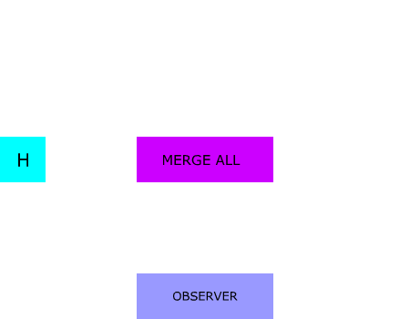

下面是与动图配套的代码示例:

```js
const a = stream(‘a’, 200, 3);
const b = stream(‘b’, 200, 3);
const h = interval(100).pipe(take(2), map(i => [a, b][i]));
h.pipe(mergeAll()).subscribe(fullObserver(‘mergeAll’));
```

可编辑的 stackblitz 在线 demo: [https://merge-all.stackblitz.io](https://merge-all.stackblitz.io).

### ConcatAll

此操作符将合并所有内部流发出的值，合并方式就如同 `concat` 操作符，是按顺序连接。

在下面的动图中，可以看到高阶流 `H` ，它会生成两个内部流 `A` 和 `B` 。 `concatAll` 操作符首先从流 `A` 中取值，然后再从流 `B` 中取值，并将所有值传递到结果流中。

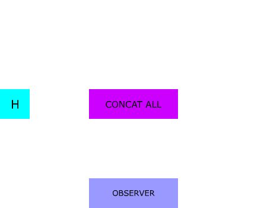

下面是与动图配套的代码示例:

```js
const a = stream(‘a’, 200, 3);
const b = stream(‘b’, 200, 3);
const h = interval(100).pipe(take(2), map(i => [a, b][i]));
h.pipe(concatAll()).subscribe(fullObserver(‘concatAll’));
```

可编辑的 stackblitz 在线 demo: [https://concat-all.stackblitz.io](https://concat-all.stackblitz.io).

### SwitchAll

有时候从所有内部流中接收值并非是我们想要的效果。在某些场景下，我们可能只对最新的内部流中的值感兴趣。一个比较好的例子就是搜索。当用户输入关键字时，就向服务器发送请求，因为请求是异步的，所以返回的请求结果是一个 observable 。在请求结果返回之前，如果用户更新了搜索框中的关键字会发生什么情况？第二个请求将会发出，现在已经有两个请求发送给服务器了。但是，第一次搜索的结果用户已经不再关心了。更有甚者，如果第一次的搜索结果要是晚于第二次的搜索结果的话 (译者注: 比如服务器是分布式的，两次请求请求的不是同一个节点)，那么用户看到的结果将是第一次的，这会让用户感到困扰。我们不想让这种事情发生，这也正是 `switchAll` 操作符的用武之地。它只会订阅最新的内部流并忽略(译者注: 忽略 = 取消订阅)前一个内部流。

在下面的动图中，可以看到高阶流 `H` ，它会生成两个内部流 `A` 和 `B` 。`switchAll` 操作符首先从流 `A` 中取值，当发出流 `B` 的时候，会取消对流 `A` 的订阅，然后从流 `B` 中取值，并将值传递到结果流中。

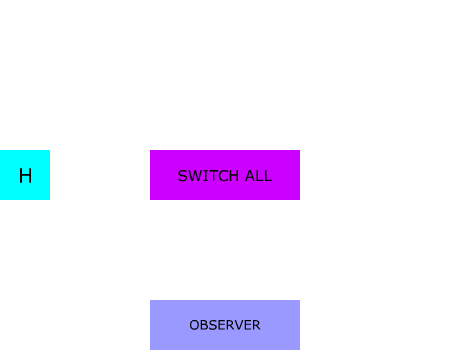

下面是与动图配套的代码示例:

```js
const a = stream(‘a’, 200, 3);
const b = stream(‘b’, 200, 3);
const h = interval(100).pipe(take(2), map(i => [a, b][i]));
h.pipe(switchAll()).subscribe(fullObserver(‘switchAll’));
```

可编辑的 stackblitz 在线 demo: [https://switch-all.stackblitz.io](https://switch-all.stackblitz.io).

### concatMap、 mergeMap 和 switchMap

有趣的事是映射操作符 concatMap、 mergeMap 和 switchMap 的使用频率要远远高于它们所对应的处理高阶 observable 的操作符 `concatAll`、 `mergeAll` 和 `switchAll` 。但是，如果你细想一下，它们几乎是一样的。所有 `*Map` 的操作符实际上都是通过两个步骤来生成高阶 observables 的，先映射成高阶 observables ，再通过相对应的组合逻辑来处理高阶 observables 所生成的内部流。

我们先来看下之前的 `meregeAll` 操作符的代码示例:

```js
const a = stream('a', 200, 3);
const b = stream('b', 200, 3);
const h = interval(100).pipe(take(2), map(i => [a, b][i]));
h.pipe(mergeAll()).subscribe(fullObserver('mergeAll'));
```

`map` 操作符生成了高阶 observables ，然后 `mergeAll` 操作符将这些内部流的值进行合并，使用 `mergeMap` 可以轻松替换掉 `map` 和 `mergeAll` ，就像这样:

```js
const a = stream('a', 200, 3);
const b = stream('b', 200, 3);
const h = interval(100).pipe(take(2), mergeMap(i => [a, b][i]));

h.subscribe(fullObserver('mergeMap'));
```

两段代码的结果是完全相同的。`concatMap` 和 `switchMap ` 亦是如此，请大家自行试验。

## 通过配对的方式来组合流

之前的操作符都是让我们可以打平多个流并将这些流中的值原封不动地传递给结果流，就好像所有值来自同一个流。我们接下来要介绍的这组操作符都接收多个流作为输入，但不同之处在于它们将每个流中的值进行配对，然后生成单个组合值(译者注: 默认是数组)来作为结果流中的值。

每个操作符都可选择性地接收一个投射函数 ( projection function ) 作为最后的参数，该函数定义额了结果流中的值如何进行组合。在本文的示例中，我都将使用默认的投射函数，它只是简单地通过逗号作为分隔符将值连接起来。在本节的最后我将展示如何使用自定义的投射函数。

### CombineLatest

第一个介绍的操作符是 `combineLatest` 。使用它可以取多个输入流中的最新值，并将这些值转换成一个单个值传递给结果流。RxJS 会缓存每个输入流中的最新值，只有当所有输入流都至少发出一个值后才会使用投射函数(从之前缓存中取出最新值)来计算出结果值，然后通过结果流将计算的结果值发出。

当所有输入流完成时，结果流就会完成，如何任意输入流报错，那么结果流就会报错。如果某个输入流没有完成的话，那么结果流便不会完成。换句话说，如何任何输入流没发出值就完成了，那么结果流也将完成，并且在完成的同时不会发出任何值，因为无法从已完成的输入流中取值放入到结果流中。还有，如果某个输入流即不发出值，也不完成，那么 `combineLatest` 将永远不会发出值以及完成，原因同上，它将一直等待全部的输入流都发出值。

如果你需要对某些状态的组合进行求值，并且当其中某个状态发生变化时再次进行求值，则此运算符非常有用。最简单的例子就是监控系统。每个服务都可以用一个流来表示，流返回布尔值以标识服务是否可用。当所有服务都可用时，监控状态会是绿灯，所以投射函数应该只是简单地执行逻辑与操作即可。

在下面的动图中，可以看到 `combineLatest` 操作符组合了两个流 `A` 和 `B` 。一旦所有的输入流都至少发出一个值后，结果流会将这些值组合后发出:

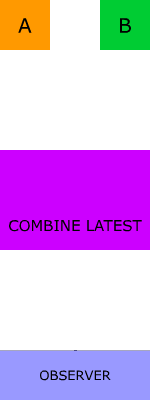

下面是与动图配套的代码示例:

```js
const a = stream('a', 200, 3, 'partial');
const b = stream('b', 500, 3, 'partial');
combineLatest(a, b).subscribe(fullObserver('latest'));
```

可编辑的 stackblitz 在线 demo: [https://combine-latest.stackblitz.io](https://combine-latest.stackblitz.io).

### Zip

`zip` 操作符的合并方式也非常有趣，它的机制在某种程度上类似于衣服或者包上的拉链。它将两个及两个以上的输入流中的对应值组合成一个元祖(两个输入流的情况下为一对)。它会等待所有的输入流中都发出相对应的值后，再使用投射函数来将其转变成单个值，然后在结果流中发出。只有从每个输入流中凑齐对应的新值时，结果流才会发出值，因此如果其中一个输入流比另一个的值发出地更快，那么结果值发出的速率将由两个输入流中的较慢的那个决定。

当任意输入流完成时并且与之配对的值从其他输入流发出后，结果流也将完成。如果任意输入流永远不完成的话，那么结果流也将永远不会完成，如果任意输入流报错的话，结果流也将报错。

使用 `zip` 操作符可以很简单地实现使用定时器来生成范围值的流。下面是基础示例，其中使用投射函数来只返回 `range` 流中的值:

```js
zip(range(3, 5), interval(500), v => v).subscribe();
```

在下面的动图中，可以看到 `zip` 操作符组合了两个流 `A` 和 `B` 。一旦相对应的值配对成功，结果流就会发出组合值:

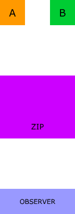

下面是与动图配套的代码示例:

```js
const a = stream('a', 200, 3, 'partial');
const b = stream('b', 500, 3, 'partial');

zip(a, b).subscribe(fullObserver('zip'));
```

可编辑的 stackblitz 在线 demo: [https://zip.stackblitz.io](https://zip.stackblitz.io).

### forkJoin

有时候，有一组流，但你只关心每个流中的最后一个值。通常这些流也只有一个值。举个例子，你想要发起多个网络请求，并只想当所有请求都返回结果后再执行操作。此操作符的功能与 [Promise.all](https://developer.mozilla.org/en-US/docs/Web/JavaScript/Reference/Global_Objects/Promise/all) 类似。但是，如果流中的值多于一个的话，除了最后一个值，其他都将被忽略掉。

只有当所有输入流都完成时，结果流才会发出唯一的一个值。如果任意输入流不完成的话，那么结果流便永远不会完成，如何任意输入流报错的话，结果流也将报错。

在下面的动图中，可以看到 `forkJoin` 操作符组合了两个流 `A` 和 `B` 。当所有输入流都完成后，结果流将每个输入流中的最后一个值组合起来并发出:

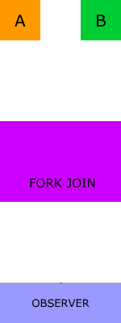

下面是与动图配套的代码示例:

```js
const a = stream('a', 200, 3, 'partial');
const b = stream('b', 500, 3, 'partial');

forkJoin(a, b).subscribe(fullObserver('forkJoin'));
```

可编辑的 stackblitz 在线 demo: [https://fork-join.stackblitz.io](https://fork-join.stackblitz.io).

### WithLatestFrom

本文最后介绍的一个操作符是 `withLatestFrom` 。当有一个主线流，同时还需要其他流的最新值时，可以使用此操作符。`withLatestFrom` 与 `combineLatest` 有些类似，不同之处在于 `combineLatest` 是当任意输入流发出值时，结果流都发出新的值，而 `withLatestFrom` 是只有当主线流发出值时，结果流才发出新的值。

如同 `combineLatest` ，`withLatestFrom` 会一直等待每个输入流都至少发出一个值，当主线流完成时，结果流有可能在完成时从未发出过值。如果主线流不完成的话，那么结果流永远不会完成，如果任意输入流报错的话，结果流也将报错。

在下面的动图中，可以看到 `withLatestFrom` 操作符组合了两个流 `A` 和 `B` ，`B` 是主线流。每次 `B` 发出新的值时，结果流都会使用 `A` 中的最新值来发出组合值:

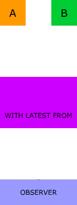

下面是与动图配套的代码示例:

```js
const a = stream('a', 3000, 3, 'partial');
const b = stream('b', 500, 3, 'partial');

b.pipe(withLatestFrom(a)).subscribe(fullObserver('latest'));
```

可编辑的 stackblitz 在线 demo: [https://with-latest-from.stackblitz.io](https://with-latest-from.stackblitz.io).

### 投射函数

正如本节开始所提到的，所有通过配对的方式来组合流的操作符都可以接收一个可选的投射函数。此函数定义了结果值是如何进行转换的。使用投射函数可以选择只发出某个特定输入流中的值或者以任意方式来连接值:

```js
// 返回第二个流中的值
zip(s1, s2, s3, (v1, v2, v3) => v2)
// 使用 - 作为分隔符来连接值
zip(s1, s2, s3, (v1, v2, v3) => `${v1}-${v2}-${v3}`)
// 返回单个布尔值
zip(s1, s2, s3, (v1, v2, v3) => v1 && v2 && v3)
```

如果想集中看所有的动图，请参见 [Pierre Criulanscy](https://medium.com/@pierrecriulanscy) 的这个 [gist](https://gist.github.com/PCreations/99765f48b1f60c9427c479c25f3e3bbd) 。
