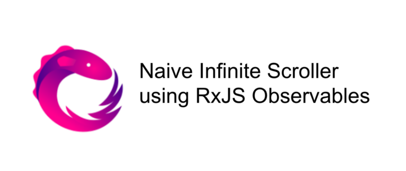
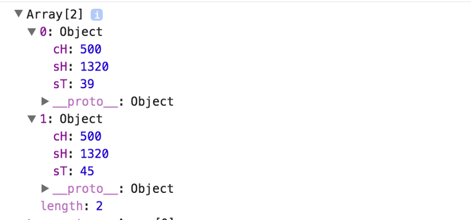
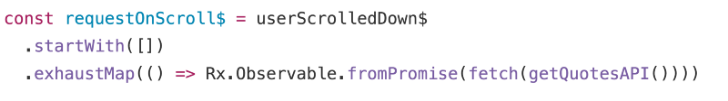

# [译] 使用响应式编程来实现简易版的无限滚动加载

> 原文链接: [https://hackernoon.com/naive-infinite-scroll-in-reactive-programming-using-rxjs-observables-4a605d3146e8](https://hackernoon.com/naive-infinite-scroll-in-reactive-programming-using-rxjs-observables-4a605d3146e8)



这是一次尝试，使用 RxJS 来实现简单的无限滚动加载。

Angular 版本实现的文章: [使用 RxJS Observables 实现的简易版无限滚动加载指令](https://codeburst.io/angular-2-simple-infinite-scroller-directive-with-rxjs-observables-a989b12d4fb1)

## 什么是响应式编程？

简单来说，它使用异步数据流进行编程。这有一篇 [Andre Staltz](https://twitter.com/andrestaltz) 所写的超棒文章及 egghead 提供的配套视频: 

文章: [不容错过的响应式编程介绍](https://gist.github.com/staltz/868e7e9bc2a7b8c1f754)

视频: [https://egghead.io/courses/introduction-to-reactive-programming](https://egghead.io/courses/introduction-to-reactive-programming)

## 什么是 RxJS？

RxJS 或 Reactive Extensions 是最先由 Microsoft Open Technologies 开发的用于转换、组合和查询数据流的库。[https://github.com/Reactive-Extensions/RxJS](https://github.com/Reactive-Extensions/RxJS) (译者注: 这是 V4 版本的 RxJS)

这是 [Ben Lesh](https://twitter.com/BenLesh) 的演讲 [用响应式的思维来使用 RxJS 5](https://www.youtube.com/watch?v=1vR9lQLfqjo&t=959s)，非常棒。

下面是 [Netanel Basal](https://twitter.com/NetanelBasal) 对 Observables 和少数操作符的一些精彩介绍:

  1. [Observables 揭秘](https://netbasal.com/javascript-observables-under-the-hood-2423f760584#.ptzobjg31)
  1. [RxJS: 6个你必须知道的操作符](https://netbasal.com/rxjs-six-operators-that-you-must-know-5ed3b6e238a0#.oqgxqivb2) [(简体中文)](https://github.com/RxJS-CN/rxjs-articles-translation/blob/master/articles/Six-Operators-That-You-Must-Know.md)

## 我们要做什么？

我们将要使用 observables 来开发一个简单的无限滚动加载。当用户滚动到指定容器高度的70%，我们就调用 API 从服务器获取更多的数据。我们会使用 [HackerNews 的非官方 API](https://github.com/cheeaun/node-hnapi) 来获取最新的新闻。

下面是我们将使用到的 RxJS 操作符:

  1. [map](http://cn.rx.js.org/class/es6/Observable.js~Observable.html#instance-method-map) : 与数组的 map 类似，映射传入的数据流。
  1. [filter](http://cn.rx.js.org/class/es6/Observable.js~Observable.html#instance-method-filter) : 与数组的 filter 类似，过滤传入的数据流。
  1. [pairwise](http://cn.rx.js.org/class/es6/Observable.js~Observable.html#instance-method-pairwise) : 返回由当前发出值和前一个发出值组成的数组。
  1. [startWith](http://cn.rx.js.org/class/es6/Observable.js~Observable.html#instance-method-startWith) : 返回的 observable 会在发出源 observable 的值之前先发出提供的值。
  1. [exhaustMap](http://cn.rx.js.org/class/es6/Observable.js~Observable.html#instance-method-exhaustMap) : 只有当内部 observable 完成后，才会发出新的值。
  
jsbin.com 上的完整示例: [https://output.jsbin.com/punibux](https://output.jsbin.com/punibux)

## 阶段一: 设置基础 html 和 css

导入 RxJS 库并使用 `infinite-scroller` 作为滚动容器的 id，获取的所有新闻都将追加到此容器中。

```html
<!DOCTYPE html>
<html>
<head>
  <meta charset="utf-8">
  <meta name="viewport" content="width=device-width">
  <title>Naive Infinite Scroller - RxJS</title>
  <script src="https://cdnjs.cloudflare.com/ajax/libs/rxjs/5.0.1/Rx.min.js"></script>
</head>
<body>
  <ul id="infinite-scroller">
  </ul>
</body>
</html>
```

```css
#infinite-scroller {
  height: 500px;
  width: 700px;
  border: 1px solid #f5ad7c;
  overflow: scroll;
  padding: 0;
  
  li {
    padding : 10px 5px;
    line-height: 1.5;
    &:nth-child(odd) {
      background : #ffe8d8;
    }
    &:nth-child(even) {
      background : #f5ad7c;
    }
  }
}
```

## 阶段二: 设置辅助函数，用来处理数据、渲染和计算

```js
let currentPage = 1;

const getQuotesAPI = () => {
 return 'https://node-hnapi.herokuapp.com/news?page=' + currentPage; 
};

/** 
  处理 API 返回的数据
**/
const processData = res => {
  res.json()
     .then(news => {
       currentPage++;
       news.forEach(renderNews);
     });
};

/** 
  
  渲染每条信息
**/
const renderNews = (news) => {
   const li = document.createElement('li');
   li.innerHTML = `${news.id} - ${news.title}`;
   scrollElem.appendChild(li);
};

/**
  检查用户是否向下滚动，通过前一个滚动位置
  和当前滚动位置进行判断
**/
const isUserScrollingDown = (positions) => {
  return positions[0].sT < positions[1].sT;
};

/** 
  检查滚动位置是否达到了要求的容器百分比高度
**/
const isScrollExpectedPercent = (position, percent) => {
  return ((position.sT + position.cH) / position.sH) > (percent/100);
};
```

前面三个函数都很简单:

  1. `getQuotesAPI`  —  返回 API 的 url，此 url 使用当前页码作为查询参数。
  2. `processData ` —  处理 [fetch API](https://developer.mozilla.org/en/docs/Web/API/Fetch_API) 返回的数据并增加当前页码。
  3. `renderNews ` —  接收每条新闻数据并将其渲染到页面中。

后面两个函数用来进行滚动计算:

  4. `isUserScrollingDown ` —  检测用户是否向下滚动。
  5. `isScrollExpectedPercent`  —  检测用户是否已经滚动指定的百分比，从而加载更多数据。

## 阶段三: 设置 observable 流

```js
/**
  设置流
**/
const scrollElem = document.getElementById('infinite-scroller');
const scrollEvent$ = Rx.Observable.fromEvent(scrollElem, 'scroll');
```

要捕获容器的滚动事件，我们需要创建滚动事件的 observable 。使用 [`Rx.Observable.fromEvent`](http://cn.rx.js.org/class/es6/Observable.js~Observable.html#static-method-fromEvent) 就可以完成。在变量结尾处加 `$` 是一种惯例，以表示引用的是 observable 流。

## 阶段四: 编写流的逻辑，负责处理滚动事件和调用 API 

```js
/**
  流的逻辑
**/
const userScrolledDown$ = scrollEvent$
  .map(e => ({ 
    sH: e.target.scrollHeight,
    sT: e.target.scrollTop,
    cH: e.target.clientHeight
  }))
  .pairwise()
  .filter(positions =>  {
     return isUserScrollingDown(positions) && isScrollExpectedPercent(positions[1], 70))
  });

const requestOnScroll$ = userScrolledDown$
  .startWith([])
  .exhaustMap(() => Rx.Observable.fromPromise(fetch(getQuotesAPI())))

/**
  订阅以产生效果
**/
requestOnScroll$.subscribe(processData);
```

我们将接收由 `scrollEvent`$ 发出的滚动事件并将其映射成无限滚动加载逻辑所需要的值。我们只取滚动元素的三个属性 : [` scrollHeight`](https://developer.mozilla.org/en-US/docs/Web/API/Element/scrollHeight)、 [`scrollTop`](https://developer.mozilla.org/en-US/docs/Web/API/Element/scrollTop) 和 [`clientHeight`](https://developer.mozilla.org/en-US/docs/Web/API/Element/clientHeight).

将映射过的数据传给 `pairwise` 操作符，它会发出由当前值和前一个值组成的数组，如下图所示。



现在我们将这组位置数据传给 `filter` 操作符来根据条件进行过滤:

  1. 用户是否向下滚动
  2. 用户是否已经滚动到容器的70%高度

当 `userScrollDown$` 产生符合过滤条件的值后会调用 `requestOnScroll$` 。我们给了 `requestOnScroll$` 一个空数组作为初始值。



我们使用 [`Rx.Observable.fromPromise`](http://cn.rx.js.org/class/es6/Observable.js~Observable.html#staic-method-fromPromise) 来将 promise 转化成 observable 。`fetch` 发起 http 请求并返回 promise 。`exhaustMap` 会进行等待，直到 fetch 完成并且内部 observable 发出 API 返回的数据。

**Observables 是懒加载的**。这意味着除非订阅了它们，它们才会执行。 我们订阅 `requestOnScroll$` 并传入 `processData` 作为订阅方法。当 `exhaustMap` 发出 API 的返回数据后，数据会传给 `processData`，然后执行 `renderNews` 将数据渲染到页面中。

下面的 gif 图片实际演示了无限滚动加载的效果，注意观察右边的滚动条。


## _在我的下篇文章中，我将会尝试在 Angular 中创建一个无限滚动加载指令来实现它。_

更新: 这是我下篇文章的链接 [使用 RxJS Observables 实现的简易版无限滚动加载指令](https://codeburst.io/angular-2-simple-infinite-scroller-directive-with-rxjs-observables-a989b12d4fb1)