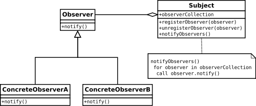

# [译] 关于 RxJS 中的 Subject

> 原文链接: [https://medium.com/@benlesh/on-the-subject-of-subjects-in-rxjs-2b08b7198b93](https://medium.com/@benlesh/on-the-subject-of-subjects-in-rxjs-2b08b7198b93)

RxJS 中的 Subjects 经常被误解。因为它们允许你命令式地向 Observable 流中推送值，当人们不太清楚如何将某个东西变成 Observable 时，他们倾向于滥用 Subjects 。此模式看起来有点像这样...

```javascript
// 当人们发现不太清楚如何做时，通常会首先使用 Subjects
// (不要这样做)
const subject = new Subject();
button.addEventListener('click', () => subject.next('click');
subject.subscribe(x => console.log(x));
```

虽然这对于 RxJS 新手 (对于这个阶段来说太正常不过了) 很有帮助，但这不是以 “Rx 的方式”在处理问题。理想的是在 Observable 中包装事件注册，既可以监听事件，又可以取消事件监听。看起来像这样:

```javascript
// 这样好些了，但请使用 Observable.fromEvent(button, 'click') 来替代
const clicks = new Observable(observer => {
  const handler = (e) => observer.next(e);
  button.addEventListener('click', handler);
  return () => button.removeEventListener('click', handler);
});
```

为什么展示这个跟 Subjects 没半点关系的示例？好吧，一点是它展示了为什么不总是需要使用 Subject，另外一点这有个隐藏的 subject... (某种程度上可以说是 subject )。这里要注意的一点是，这个 Observable 包装了对于按钮的 addEventListener 事件处理函数的注册操作，而 addEventListener 本身就是一个 subject 。…至少根据 [“Gang Of Four” 的观察者模式](https://en.wikipedia.org/wiki/Design_Patterns)来说是这样的。

## 观察者模式

你可能知道，RxJS 主要是关于 Observables 和 Observers 的，但它也是 Subjects 相关的。然而在 Gof 的 [设计模式](https://en.wikipedia.org/wiki/Design_Patterns)中是找不到 observables 的，Subjects 和 Observers 是 [观察者模式](https://en.wikipedia.org/wiki/Observer_pattern)中的根本。



模式本身很简单。Observers 是具有通知方法的类，Subject 也是类，它具有向内部观察者列表添加或删除观察者的方法和通知观察者列表的方法。

RxJS 中的 Subjects 并没有太差区别。当使用 observer 对 Rx Subject 调用 `subscribe` 时，Subject 会将该 observer 添加到内部的观察者列表中。同样的，如果使用一到三个函数来调用 `subscribe`，Subject 会将它们包装成一个 observer，然后添加到观察者列表中。当调用 Subject 的 `next(value)` 时，它会遍历观察者列表并将 `value` 传递给 `next` 方法。对于 `error` 和 `complete` 也是同样的。要想从 subject 的观察者列表中移除 observer，只需简单调用 subscription 的 `unsubscribe` 方法即可，subscription 是将 observer 添加到观察者列表中时返回的。

```javascript
const subject = new Subject();
// 将 observer1 添加到观察者列表
const sub1 = subject.subscribe(observer1);
// 将 observer2 添加到观察者列表
const sub2 = subject.subscribe(observer2);
// 使用 "hi there" 来通知列表中的所有观察者
subject.next('hi there');
// 将 observer1 从观察者列表中移除
sub1.unsubscribe();
```

## Subject 相比较于 Observable 

实际上，RxJS 中的 Subjects 不同于 GoF 观察者模式中的 Subjects，但它们的 API 是 Observable 的鸭子类型。实际上，在 RxJS 中 Subjects 更甚，它们继承自 Observable 。优点是所有 Subjects 都具有与 Observable 相同的操作符和方法。

大概 Subject 和 Observable 之间一个很重要的区别就是 Subject 是有状态的，它维护观察者列表。另一方面，[Observable 真的只是一个函数](https://medium.com/@benlesh/learning-observable-by-building-observable-d5da57405d87)，它建立了观察本身。

虽然 Subjects 是 Observables，但 Subjects 还实现了 Observer 接口。也就是说，它们拥有 `next`、`error` 和 `complete` 方法。这些方法用来通知 subject 内部观察者列表中的 observers 。这意味着 subject 可以用作订阅任何 observable 的 observer 。

```javascript
// 为了使两个观察者 observer1 和 observer2 “共享” tick$，
// 我们可以通过 Subject 来传输所有通知，像这样
const tick$ = Observable.interval(1000);
const subject = new Subject();
subject.subscribe(observer1);
subject.subscribe(observer2);
tick$.subscribe(subject);
```

上面的示例是将 observable `tick$` “多播” 给两个观察者: `observer1` 和 `observer2` 。这其实就是 RxJS 中大多数多播操作符内部所做的事情。例如 `publish`、`publishReplay`、`multicast`、`share`，等等。真的，这才是 RxJS 中 Subjects 的主要用法。

## Subjects 是不可重用的

在 RxJS 中，Subjects 不能重用。也就是说，当一个 Subject 完成或报错时，便不可再使用了。如果你尝试在已关闭的 Subject (调用过 `complete` 或 `error` 方法)上调用 `next`，它会默认忽略通知。如果想 Subject 在完成后调用 `next` 时进行显示地报错，你可以在 subject 实例上直接调用 `unsubscribe` 。

```javascript
// Subject 之死
const subject = new Subject();
subject.subscribe(x => console.log(x));
subject.next(1);    // 1
subject.next(2);    // 2
subject.complete();
subject.next(3);    // 悄悄地忽略
subject.unsubscribe();
subject.next(4);    // Unhandled ObjectUnsubscribedError
```

## RxJS 中的陷阱

但是在 RxJS 的当前版本中，会带来了一些令人困惑的痛点。因为 Rx observables 不会“捕获”错误，我们会遭遇一些奇怪的行为。我曾经嘲笑过 Promises 实现了错误“捕获”，但在多播场景中它或许是正确的。我的意思是当我说 Rx observable 不“捕获”错误时，是表示当错误渗透到观察者链末端并的末端时，如果错误未被处理，它会被重新抛出。

```javascript
// 演示缺少错误处理时会进行重新抛出
const badObservable = Observable.throw(new Error('haha'));
try {
  badObservable.subscribe({
    next: x => console.log(x),
    error: null,
    complete: () => console.log('done')
  });
} catch (err) {
  console.error(err); // 输出自定义错误: "haha"
}
```

现在我们来想想，当你循环观察者列表并通知它们时会发生什么(正如 subject 所做的)。

```javascript
for (let observer of observers) {
  observer.next('notify'); // 如果在这里调用 throw 会发生什么？
}
// 提示: 会报错会打破循环
// 注意: 好吧，这不仅仅是个提示
```

假设一些操作符是同步处理的(`map`、`filter`、`scan` 等等)，如果其中一个或任何其它同步操作符报错了，你会在多播(使用 Subject 来循环观察者列表并通知它们)的下游得到一些诡异的行为:

```javascript
// 会发生奇怪的行为
const source$ = Observable.interval(1000).share();
const mapped$ = source$.map(x => {
  if (x === 1) {
    throw new Error('oops');
  }
  return x;
});
source$.subscribe(x => console.log('A', x));
mapped$.subscribe(x => console.log('B', x));
source$.subscribe(x => console.log('C', x));
// "A" 0
// "B" 0
// "C" 0
// "A" 1
// Uncaught Error: "oops"
```

在上面的示例中，大多数用户会期望 A 和 C 能继续通知。输出 B 的 observable 死了是可以理解的，它报错了，但其他流和源流也死了令人想当困惑。任意的第三方都可以杀掉共享的 observable 流以及未知数量的兄弟流，不应该是这样的。这是一个脆弱的抽象，我们需要在 RxJS 接下来的版本中修复它。

临时解决上述场景中的问题很简单，感谢调度器( schedulers )。你可以在多播后使用 `observeOn`，这样就可以解决此问题，因为错误不再是同步抛出的。

```javascript
const source$ = Observable.interval(1000)
  .share()
  .observeOn(Rx.Scheduler.asap); // 点睛之笔
const mapped$ = source$.map(x => {
  if (x === 1) {
    throw new Error('oops');
  }
  return x;
});
source$.subscribe(x => console.log('A', x));
mapped$.subscribe(x => console.log('B', x));
source$.subscribe(x => console.log('C', x));
// "A" 0
// "B" 0
// "C" 0
// "A" 1
// Uncaught Error: "oops"
// "C" 1
// "A" 2
// "C" 2 
// "A" 3
// "C" 3
// ... 等等
```

还有另一种临时解决方案，如果你可以管理它的话，它的性能会更好一些，方法是只需为所有的 subscriptions 添加错误处理方法。

```javascript
const source$ = Observable.interval(1000)
  .share()
  .observeOn(Rx.Scheduler.asap); // 点睛之笔
const mapped$ = source$.map(x => {
  if (x === 1) {
    throw new Error('oops');
  }
  return x;
});
source$.subscribe(x => console.log('A', x));
mapped$.subscribe(
  x => console.log('B', x),
  err => console.log('Error handled: ' + err.message)
);
source$.subscribe(x => console.log('C', x));
// "A" 0
// "B" 0
// "C" 0
// "A" 1
// "Error handled: oops"
// "C" 1
// "A" 2
// "C" 2 
// "A" 3
// "C" 3
// ... 等等
```

## Observable 的未来

[TC39 Observable 提议](https://github.com/tc39/proposal-observable) 新的化身，不包括 `CancelToken` 业务，提议本身就是一整篇文章，它可能会在没有错误处理方法的情况下通过“捕获”错误来解决这个问题。也就是说，它不再会到达观察者链末端并重新抛出错误。在 RxJS 未来的版本中，我想我们也会做同样的事情，因为这才是正确的。当然，这个问题是公开讨论的，但我个人认为这不会有太多阻力。

## 总结

1. Subjects 既是 observer，又是 observable
2. Subjects 对内部的观察者列表进行“多播”
3. Observables 只是建立观察的函数
4. Observables 当前不会捕获错误，但它们应该捕获
5. 向 Subject 的下游同步抛出错误会杀掉此 Subject
6. 你可以使用错误处理方法或 observeOn 来解决 #4 中的问题
7. 关于 Promise 的错误捕获，我错了。这是个好主意，因为 promises 是多播的 *
8. 未来版本的 RxJS 很可能会捕获错误

* 虽然可能不是完全必要的，因为 promises 永远是异步的。 (耸肩脸)