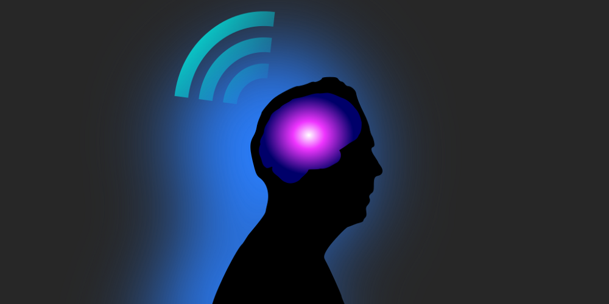
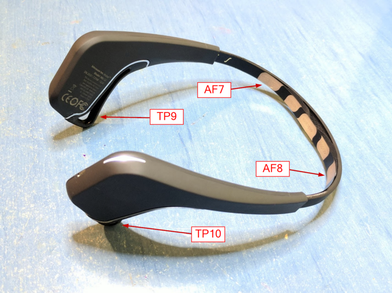
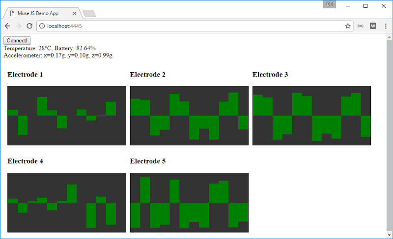
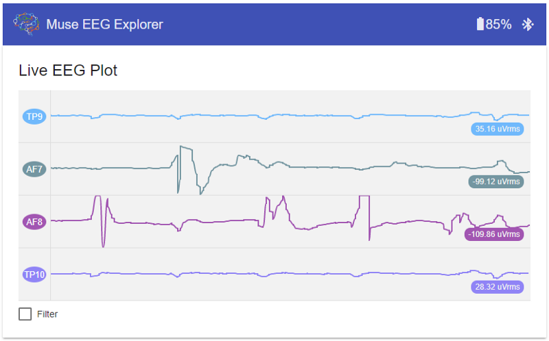
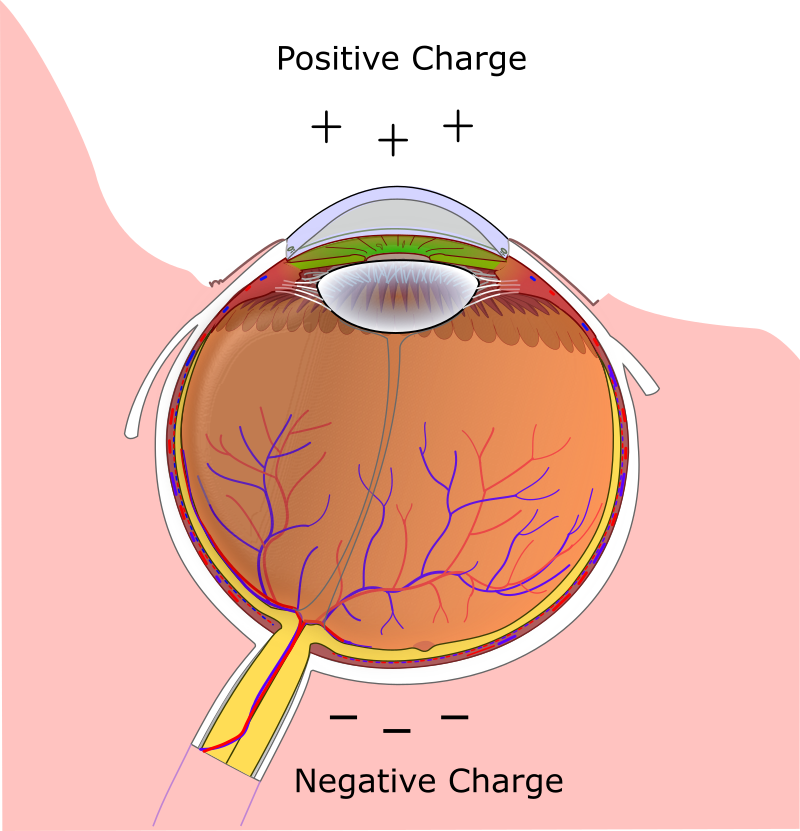
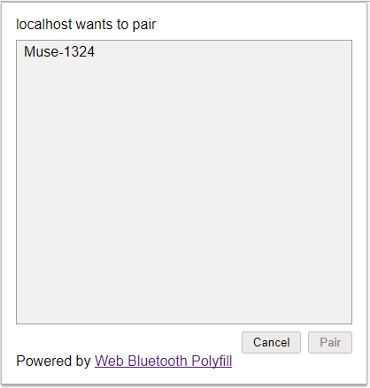
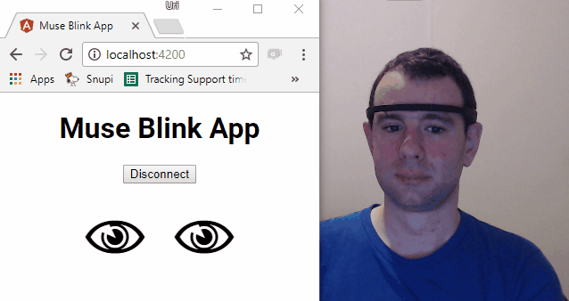

# [译] 响应式脑电波

> ## 如何使用 RxJS、Angular、Web 蓝牙以及脑电波头戴设备来让我们的大脑做一些更酷的事

> 原文链接: [https://medium.com/@urish/reactive-brain-waves-af07864bb7d4](https://medium.com/@urish/reactive-brain-waves-af07864bb7d4)

几个月前，我偶然间发现了一台蓝牙智能脑电波头戴设备。我突然意识到它的巨大潜力，使用它可以做一些超级酷的事情：使用 Web 蓝牙，可以直接用大脑与网页进行通讯！



原始图片: [https://commons.wikimedia.org/wiki/File:Mr_Pipo_Enlightment.svg](https://commons.wikimedia.org/wiki/File:Mr_Pipo_Enlightment.svg)

脑电波 ( Electroencephalography，简称 EEG ) 本质上是监控脑电活动的一种方式。它通常需要在头皮上放置几个电极，然后收集关于神经元发射的信息，最后将信息记录在图表上。听起来像是一些想当不错的数据可供我使用！虽然脑电波主要用于医疗用途，但仍会不时出现一些新颖的使用案例。

其中一个新颖的使用案例便是 [Muse](http://www.choosemuse.com/)，它是一种消费产品，花费$250便可以帮助你学习如何进行冥想，同时它还是自带蓝牙、消耗脑电波的实体设备。虽然它能够教会你如何平静下来，但对我来说，只有弄清楚如何在网页上消费这些数据后，我才能平静下来！

_(如果你也无法保持平静的话，可选择略过此部分，直接查看下面的代码教程 ;-)_

头戴设备配备 Android 或 IOS 应用，甚至还提供了一个库，这样你就可以获取原始数据并构建自己的应用，但这个库只能在原生应用中运行，而且源码不是开源的 (因此，我想用大脑控制网页的梦想起初看来是视乎是无法达成的的)。

在参加 ng-cruise 时，我遇到了 [Alex Castillo](https://medium.com/@castillo.io)，他的演讲展示了如何将他叫做 OpenBCI 的开源硬件脑电波头戴设备与 Angular 进行连接并将信号可视化。尽管这一切令人印象深刻，但他不得不使用 node.js 进行复杂的设置和 Web socket 服务器来传播数据，这离我想要的还有一定差距。后来在 ng-cruise 的黑客之夜，每个人都在尝试使用各种硬件设备来做一些很酷的东西，这些设备中就包括脑电图设备，所以我自然不会错过如此良机。

我尝试对 Muse 的蓝牙协议进行逆向工程，类似于[这篇文章](https://medium.com/@urish/reverse-engineering-a-bluetooth-lightbulb-56580fcb7546)所做的。大约进行了一个小时，我想到之前可能有人已经做到了，所以我 google 了我所发现的一个特征数字，并找到了这篇[超棒的文章](https://medium.com/m/global-identity?redirectUrl=https://articles.jaredcamins.com/figuring-out-bluetooth-low-energy-8c2a2716e376)，反过来这篇文章指出了由 [Alexandre Barachant](https://medium.com/@alexandre.barachant) 创建的 [python 库](https://github.com/alexandrebarachant/muse-lsl/blob/d2b74412585f3baa852516542a0d0853faec1b4e/muse/muse.py)，突然间，我拥有了我所需的一切：这就是 muse-js 诞生的过程。

所以现在我可以将 Web 和 Muse 头戴设备进行连接并接受脑电波数据 (还包括电池电量、加速计/陀螺仪，等等)。万岁！

那么接下来我要用它做什么呢？

## 硬件

在深入代码之前，我们首先来了解下 Muse 头戴设备。基本上，它就是一个轻量级的可充电头带。它配备了4个脑电波电极：2个在前额，眼睛稍微往上一些，另外2个与耳朵接触。此外，它还配备了螺旋仪和加速计，这样可以计算出头的方位。我很高兴我发现了它还有另外一个脑电波传感器，这样就可以连接到自己的电极了 (尽管是 Micro USB 接口)，我打算尽快进行尝试。

注意头带有两个版本：2014款和2016款。你想要的肯定是2016款，它使用了蓝牙低耗能。2014款使用的是经典蓝牙，因此无法与 Web 蓝牙一起使用。



Muse 2016: AF7 和 AF8 是前额电极, TP9 和 TP10 是耳电极

## 使用 RxJS 的响应流

构建库时，我需要决定如何暴露传入的脑电波数据。使用 Web 蓝牙，每当接收到新的数据包时都会触发一个事件。每个数据包包含来自单个电极的12个样本。我本可以让用户注册一个 JavaScript 函数，每当接收到新数据时便调用此函数，但我最后决定使用 RxJS 库 (JavaScript 的响应式扩展库)，它包括用于转换，组合和查询数据流的各种方法。

RxJS 的优势是它提供了一组函数，可让你操纵和处理从 Muse 头戴设备接收到的原始数据字节，以便将其转换为更有用的东西 (比如我们马上要做的)。

## 可视化

首先映入脑海的便是使用我们全新的 muse-js 可视化数据。黑客之夜当晚，Alex 和我开始开发 [angular-muse](https://github.com/urish/angular-muse)，这是一个 Angular 应用，它可以将脑电波数据和头部方向进行可视化。



我的 Muse 数据可视化初始原型

事实上，如果你拥有 Muse 设备和 [支持 Web 蓝牙的浏览器](https://medium.com/@urish/is-now-a-good-time-to-start-using-web-bluetooth-hint-yes-yes-it-is-99e998d7b9f6)，你便可以实际打开 [Demo 页面](https://muse-eeg-app.firebaseapp.com/)亲自尝试！



使用 Muse、 Angular 和 Smoothie Charts 将我的大脑活动进行可视化

这个应用以一种简单的方式证明了数据是流式传输，但老实说，查看数据图确实能够吸引人，但如果只是这样而已，那么你将很快失去对它的兴趣。

## 关于眨眼

脑电波所做的众多事情之一便是测量头皮上不同位置的电势 (电压)。测量的信号是大脑活动的副作用，可用于检测一般心理状态 (如浓度水平、突发刺激的检测，等等)。

除了大脑活动之外，还可以使用称为[眼球电图检查](https://en.wikipedia.org/wiki/Electrooculography) (幸运的是，我的女朋友就是验光师，她能够教我很多这方面的知识) 的技术来检测眼部运动。Muse 设备有两个电极位于前额 (在标准的 [10-20定位系统](https://en.wikipedia.org/wiki/10%E2%80%9320_system_%28EEG%29)中称为 AF7 和 AF8)，它们靠近双眼，所以我们能够轻而易举地监控眼部运动。



我们的眼睛：角膜前方带正电，视网膜背部带负电

我们将使用这些电极的信号作为我们脑电图程序的 “Hello World”， 该程序会通过监测眼睛活动来检测眨眼。

## 开始编码！

我们的开发思路如下：我们从设备中获取传入的脑电波样本流 (如上所述，muse-js 将提供 RxJS Observable)，然后过滤出我们所需的 AF7 电极 (也就是左眼)，再然后我们会在信号中找寻峰值，例如，绝对值超过500mV的样本意味着发生了大变化。由于电极在眼睛旁边，我们期望眼球的运动产生显着的电势差。

虽然这可能不是检测眨眼最准确的方法，但它对我来说非常有用，并且代码简单易行 (就像所有优秀的 “Hello World” 示例那样 ;-) 。

但在开始之前，首先需要在项目中安装 `muse-js`...

```shell
npm install --save muse-js
```

...然后在代码中进行导入。在这个示例中，它是一个 Angular 应用，其实只是用 Angular CLI 创建的空项目，但也可以使用 React/VueJS，随你喜欢，因为很少会有框架相关的代码。

接下来，我们将 `muse-js` 导入到应用的根组件中：

```typescript
import { MuseClient, channelNames } from `muse-js`;
```

`MuseClient` 类与头戴设备进行互动，`channelNames` 只是提供脑电图频道的映射，供开发者使用。

在组件中，我们会创建一个 `MuseClient` 的实例：

```typescript
this.muse = new MuseClient();
```

现在我们将进入略微有些棘手的部分：连接头戴设备的逻辑。

Web 蓝牙需要一些用户交互，才能够启动连接，所以我们需要添加按钮，并只有当用户点击该按钮时才实际去连接头戴设备。我们在 `onConnectButtonClick` 方法来实现连接逻辑：

```typescript
async onConnectButtonClick() {
  await this.muse.connect();
  this.muse.start();
  // TODO: 订阅脑电波数据
}
```

`MuseClient` 类实例的 `connect()` 方法启动与头戴设备的连接，`start()` 方法命令头戴设备开始对脑电波数据进行采样并将其发送到电线上。



使用 Web 蓝牙与 Muse 头戴设备配对

接下来我们需要订阅 `muse.eegReadings` observable 上的脑电波数据 (这段代码放到上面的 TODO 注释处)：

```typescript
const leftEyeChannel = channelNames.indexOf('AF7');

this.leftBlinks = this.muse.eegReadings
  .filter(r => r.electrode === leftEyeChannel)
```

上面的代码接收来自设备的脑电波读数，并过滤出位于左眼上方的 AF7 电极。每个数据包包含12个样本，observable 流中每一项都是具有以下结构的对象：

```typescript
interface EEGReading {
  electrode: number;
  timestamp: number;
  samples: number[];
}
```

`electrode` 包含电极的数字索引 (使用 `channelNames` 数组映射出更友好的名称)，`timestamp` 包含相对于记录开始时采样的时间戳，`samples` 是12个浮点数的数组，每项都是一个脑电波测量，以 mV (微伏) 为单位。

下一步，我们只想得到每个数据包中的最大值 (例如，最大输出值的测量)。我们使用 RxJS 中的 `map` 操作符：

```typescript
this.leftBlinks = this.muse.eegReadings
  .filter(r => r.electrode === leftEyeChannel)
  .map(r => Math.max(...r.samples.map(n => Math.abs(n))))
```

所以现在我们拥有一个简单的数字流，我们可以过滤出值大于500的数字，那很可能就是我们正在找寻的眨眼：

```typescript
this.leftBlinks = this.muse.eegReadings
    .filter(r => r.electrode === leftEyeChannel)
    .map(r => Math.max(...r.samples.map(n => Math.abs(n))))
    .filter(max => max > 500)
```

到这里，我们有了一个简单的 RxJS 管道，它用于眨眼检测，但为了实际开始接收数据，我们还需要订阅它。我们从一个简单的 `console.log `开始：

```typescript
this.leftBlinks.subscribe(value => {
  console.log('Blink!', value);
});
```

如果运行代码，你可能会看到大量的 “Blink!” 出现，直到你将头戴设备戴上，因为会有很多的静态噪音。一旦你穿戴好了你的设备，只有当你眨眼或触摸左眼时，才应该会看到 “Blink!” 消息的出现：


哇，它真的有效果！

每当你眨眼时，你可能会看到若干 “Blink!” 出现在控制台中。原因是眨眼会另电势产生变化。为了必要出现过多的 “Blinks!”，我们需要进行去抖动过滤 ( debounce )，类似于[这篇文章](https://www.arduino.cc/en/Tutorial/Debounce) 所做的。

我们来做最后的补充：我们不再将信息打印到控制台，而是当眨眼时我们实际发出值1，然后再最后一次电势改变后等待半秒再发出值0。这会过滤掉我们所看到的多余的 “Blink!”：

```typescript
this.leftBlinks = this.muse.eegReadings
    .filter(r => r.electrode === leftEyeChannel)
    .map(r => Math.max(...r.samples.map(n => Math.abs(n))))
    .filter(max => max > 500)
    .switchMap(() =>
      Observable.merge(
        Observable.of(1),
        Observable.timer(500).map(() => 0)
      )
    );
```

那么 `switchMap` 到底施了什么魔法？简单来说，每当一个新项到达时，`switchMap` 会抛弃前一个流并调用给定的函数来产生新的流。新的流由两项组成：第一个是值`1`，它是由 `Observable.of` 立即发出的，第二个是值`0`，它在500毫秒之后发出，但如果一个来自 `filter` 管道中的新项到达的话，将重新启动 `switchMap` 并抛弃前一个流中仍未发出的值`0`。

现在我们可以使用 `leftBlinks` observable 来对眨眼进行可视化！可以使用 `async` pipe 将它绑定到 Angular 模板中：

```html
<span [hidden]="leftBlinks|async">👁</span>
```

每当眨眼时，上面的代码会隐藏眼睛符号，或者我们可以切换 CSS 类，然后在闪烁时对眼睛符号进行颜色改变或执行动画：

```html
<span [class.blink]=”leftBlinks|async”>👁</span>
```

无论采用哪种方式，我建议每次只眨一只眼睛，这样可以确保你能观察到你的代码是否正常工作😜！

如果我们构建的是 React 应用，可以直接订阅 observable 并在眨眼时更新组件的 state :

```typescript
this.leftBlinks.subscribe(value => {
  this.setState({blinking: value});
});
```

现在我们做到了！脑电波的 “Hello World” 已经完成！



项目的完整代码在[这里](https://github.com/urish/muse-blink)。

## 总结

几年前，脑电波还是很昂贵的，笨重的设备只能用于医院和研究机构。如今，像你我一样的 Web 开发者都可以使用我们每天都在使用的开发工具 (浏览器、RxJS 和 Angular ) ，轻而易举地来连接和分析脑电波数据。

即使脑电波不是你的菜，你可以清楚地看到，由于各种“智能”消费品的推动，已经为开发者创造了一系列真正的好机会。我们确实生活在一个令人振奋、每天都充满惊喜的年代！

_备注： 十分感谢 [Ben Lesh](https://medium.com/@benlesh) 帮忙完善这些示例中的 RxJS 代码。_