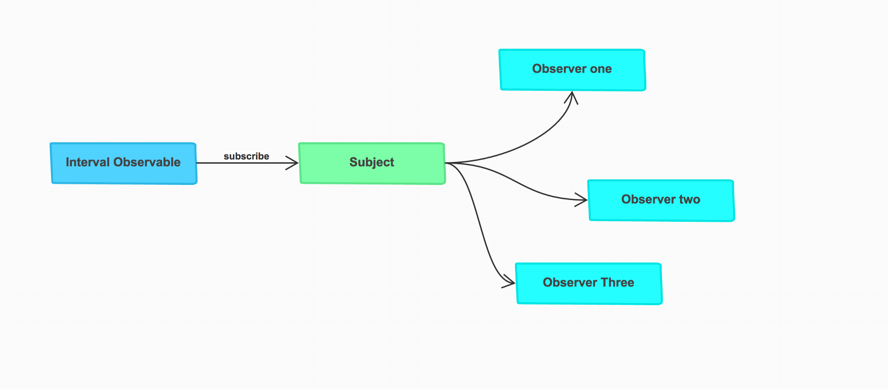
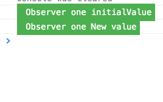
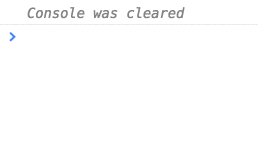

# [译] RxJS: 白话 Subjects

> 原文链接: [https://netbasal.com/rxjs-subjects-for-human-beings-7807818d4e4d](https://netbasal.com/rxjs-subjects-for-human-beings-7807818d4e4d)



我已经发表过一篇关于 Subject 的[文章](https://netbasal.com/understanding-subjects-in-rxjs-55102a190f3) ([中文](https://zhuanlan.zhihu.com/p/28061338))，但这次我想尝试一种不同的方式。

要理解 `Subject` 是什么的最简单的方式就是重新创建一个。我们来创建一个简易版的 `Subject` 。

_注意: 下面的示例只是为了阐述概念，还不足以应用于实际开发之中，还有它们并不是 Rx 中 Subjects 的真正完整实现。_

我们来看看真相。

**_Subject 既是 Observable，又是 Observer 。_**

## Subject 是 Observable

这表示它拥有所有的操作符 (`map`、`filter`，等等) 并且你可以订阅它。

```javascript
class MySubject extends Rx.Observable {
 
 constructor() {
    super();
 }
 
}
```

这是第一部分所需的一切了。它可以通过扩展 `Observable` 类成为 `Observable` 。

## Subject 是 Observer

这表示它必须实现 `next()`，`error()` 和 `complete()` 方法。

```javascript
class MySubject extends Rx.Observable {
 
 constructor() {
   super();
 }

 next() {}
  
 error() {} 
  
 complete() {}
 
}
```

好了，我们来看下一个真相。

Subject 可以扮演源 observable 和 众多观察者之间的桥梁或代理，使得多个观察者可以**共享**同一个 observable 执行。

```javascript
class MySubject extends Rx.Observable {
 
 constructor() {
   super();
   this.observers = [];
 }
 
 subscribe(observer) {
   this.observers.push(observer);
 }
 
 next(value) {
   this.observers.forEach(observer => observer.next(value));
 }
 
 error(error) {
   this.observers.forEach(observer => observer.error(error));
 }
 
 complete() {
   this.observers.forEach(observer => observer.complete());
 }
 
}
```

当你调用 `subscribe()` 方法时，仅仅是将 `observer` 添加到一个数组中。`next()`、`error()` 和 `completed()` 方法会调用数组中每个 `observer` 的对应方法。

来使用我们的 Subject 。

```javascript
const interval$ = Rx.Observable.interval(1000).take(7);

const subject = new MySubject();

subject.map(value => `Observer one ${value}`).subscribe(value => {
  console.log(value);
});

interval$.subscribe(subject);

setTimeout(() => {
  subject.map(value => `Observer two ${value}`).subscribe(value => {
     console.log(value);
  });
}, 2000);
```


当使用 `Subject` 时，无论你何时 `subject`， 你永远都会得到相同的执行，这点不同于典型的 observable，每次 `subject` 都会开启有个新的执行。(在我们的案例中，这表示你会有两个**不相关的** intervals)

**_Subject 让你同享相同的 observable 执行_**

我们来总结一下这里发生了什么。

当对 subject 调用 `subscribe` 时，只是将 `observer` 添加到数组中。

当 `subject` 扮演 `observer` 时，每当源 observable (在我们的案例中是指 `interval`) 发出值时，它会调用数组中每个 `observer` 的 `next()` 方法。

## BehaviorSubject

现在让我们来尝试实现 `BehaviorSubject` 的简易版。

我们来看看[真相](https://stackoverflow.com/questions/39494058/behaviorsubject-vs-observable/40231605#40231605)。

 * `BehaviorSubject` 需要一个初始值，因为它必须始终返回一个订阅值，即使它还没接收到 `next()` 调用。
 * 被订阅后，它会返回 subject 的最新值。
 * 无论在任何时候，你都可以在非 observable 的代码中使用 `getValue()` 方法来获取 subject 的最新值。

```javascript
class MyBehaviorSubject extends Rx.Observable {

  constructor(initialValue) {
    super();
    this.observers = [];

    if (typeof initialValue === 'undefined') {
      throw new Error('You need to provide initial value');
    }

    this.lastValue = initialValue;
  }

  subscribe(observer) {
    this.observers.push(observer);
    observer.next(this.lastValue);
  }

  next(value) {
    this.lastValue = value;
    this.observers.forEach(observer => observer.next(value));
  }
  
  getValue() {
    return this.lastValue;
  }


}
```

来使用我们的 `BehaviorSubject` 。

```javascript
const subject = new MyBehaviorSubject('initialValue');

subject.map(value => `Observer one ${value}`).subscribe(function(value) {
  console.log(value);
});

subject.next('New value');

setTimeout(() => {
  subject.map(value => `Observer two ${value}`).subscribe(function(value) {
    console.log(value);
  });
}, 2000);
```



## ReplaySubject

现在让我们来尝试实现 `ReplaySubject` 的简易版。

我们来看看[真相](https://github.com/Reactive-Extensions/RxJS/blob/master/doc/api/subjects/replaysubject.md).

  * `ReplaySubject` 表示一个对象既是 observable 序列，又是 observer 。
  * 每次通知都会广播给所有已经订阅和未来的 observers，observers 会遵循**缓冲**调整策略。

```javascript
class MyReplaySubject extends Rx.Observable {

  constructor(bufferSize) {
    super();
    this.observers = [];
    this.bufferSize = bufferSize;
    this.lastValues = [];
  }

  subscribe(observer) {
    this.lastValues.forEach(val => observer.next(val));
    this.observers.push(observer);
  }

  next(value) {
    if (this.lastValues.length === this.bufferSize) {
      this.lastValues.shift();
    }

    this.lastValues.push(value);
    this.observers.forEach(observer => observer.next(value));
  }
}
```

来使用我们的 `ReplaySubject` 。

```javascript
const subject = new MyReplaySubject(3);

subject.next('One');
subject.next('Two');
subject.next('Three');
subject.next('Four');

setTimeout(() => {
 subject.map(value => `Later Observer ${value}`).subscribe(function(value) {
   console.log(value);
 });
}, 2000);
```



## 何时使用 Subject

  * 需要共享相同的 observable 执行。
  * 当需要决定观察者迟来时该怎么做，是否使用 `ReplaySubject`、`BehaviorSubject`？
  * 需要完全控制 `next()`、`error()` 和 `completed()` 方法。

在 [Medium](https://medium.com/@NetanelBasal/) 或 [Twitter](https://twitter.com/NetanelBasal) 关注我，以阅读更多 Angular、Vue 和 JS 相关内容！