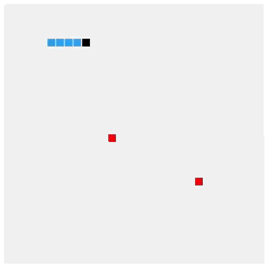
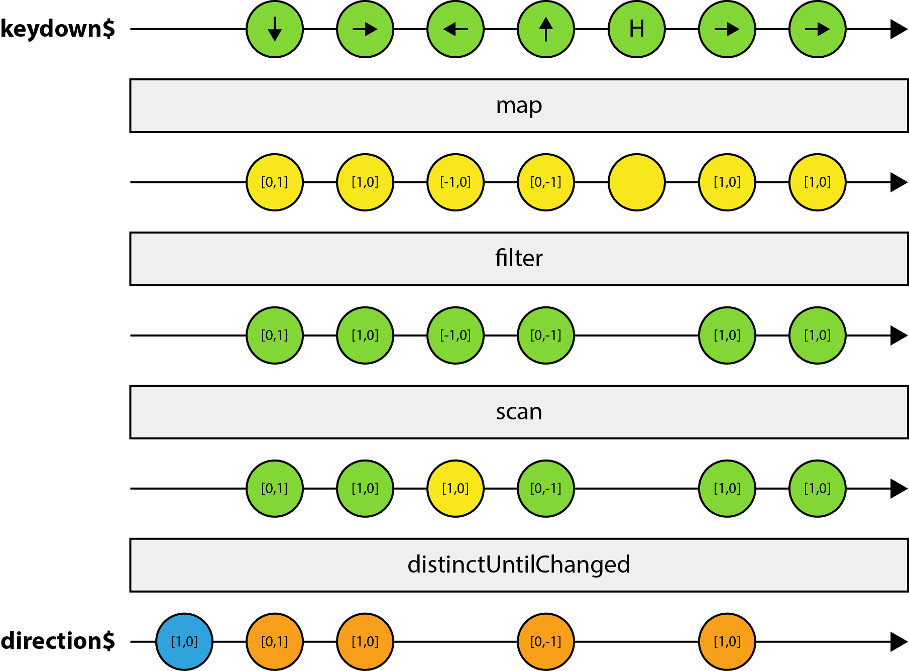
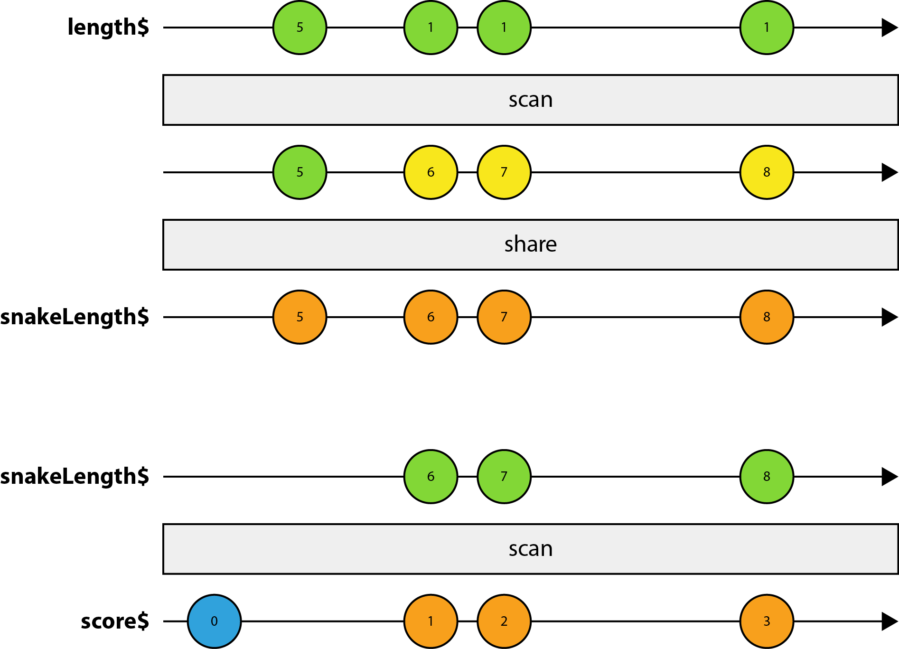
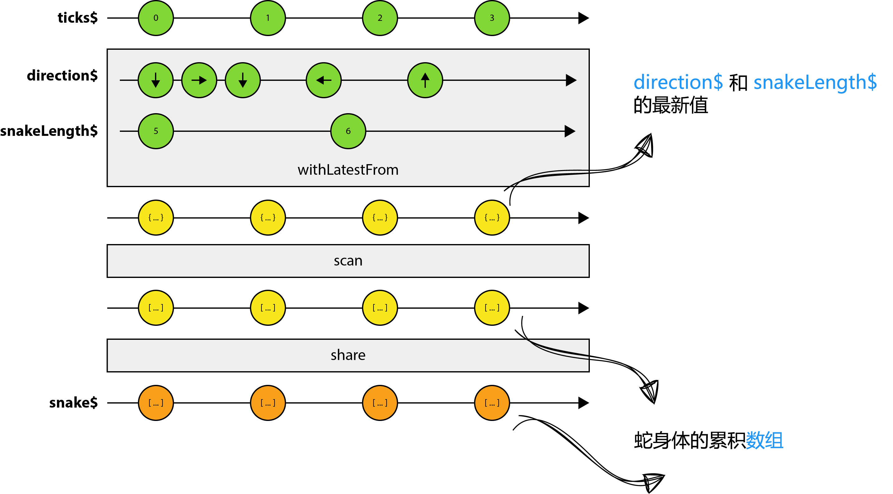
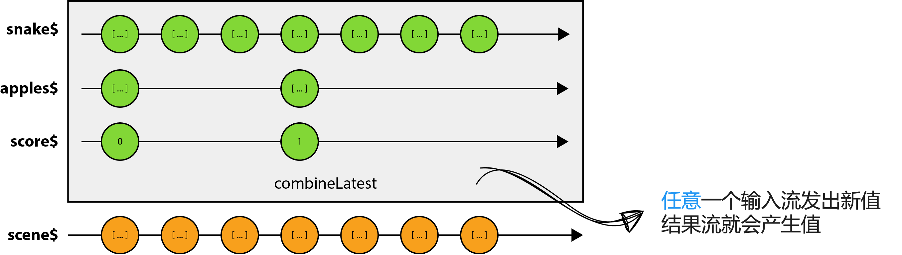

# [译] RxJS 游戏之贪吃蛇

> 原文链接: [https://blog.thoughtram.io/rxjs/2017/08/24/taming-snakes-with-reactive-streams.html](https://blog.thoughtram.io/rxjs/2017/08/24/taming-snakes-with-reactive-streams.html)

众所周知，Web 发展的很快。如今，响应式编程和 Angular 或 React 这样的框架一样，已经是 Web 开发领域中最热门的话题之一。响应式编程变得越来越流行，尤其是在当今的 JavaScript 世界。从命令式编程范式到响应式编程范式，社区已经发生了巨大的变化。然而，许多开发者还是十分纠结，常常因为响应式编程的复杂度(大量 API)、思维转换(从命令式到响应式)和众多概念而畏缩。

说起来容易做起来难，人们一旦掌握了某种赖以生存的技能，便会问自己**如果放弃这项技能，我该怎么生存？** (译者注: 人们往往不愿走出舒适区)

本文不是要介绍响应式编程，如果你对响应式编程完全不了解的话，我向你推荐如下学习资源:

  * [响应式编程入门](https://egghead.io/courses/introduction-to-reactive-programming) - [André Staltz](https://twitter.com/andrestaltz)
  * [RxJS 5: 用响应式思维来思考问题](https://www.youtube.com/watch?v=3LKMwkuK0ZE) - [Ben Lesh](https://twitter.com/BenLesh)
  * [RxJS 5 基本原理](https://chrisnoring.gitbooks.io/rxjs-5-ultimate/content/) - [Chris Noring](https://twitter.com/chris_noring)
  * [学习 RxJS](https://www.learnrxjs.io/) - [Brian Troncone](https://twitter.com/btroncone)
  * [通过示例来 RxJS 5 操作符](https://gist.github.com/btroncone/d6cf141d6f2c00dc6b35) - [Brian Troncone](https://twitter.com/btroncone)

本文的目的是在学习如何使用响应式思维来构建一个家喻户晓的经典电子游戏 - 贪吃蛇。没错，就是你知道的那个！这个游戏很有趣，但系统本身并不简单，它要保存大量的外部状态，例如比分、计时器或玩家坐标。对于我们要实现的这个版本，我们将重度使用 Observable 和一些操作符来彻底避免使用外部状态。有时，将状态存储在 Observable 管道外部可能会非常简单省事，但记住，我们想要拥抱响应式编程，我们不想依赖任何外部变量来保存状态。

**注意**: 我们只使用 **HTML5**、**JavaScript** 和 [RxJS](http://reactivex.io/rxjs/) 来将编程事件循环 (programmatic-event-loop) 的应用转变成响应事件驱动 (reactive-event-driven) 的应用。

代码可以通过 [Github](https://github.com/thoughtram/reactive-snake) 获取，另外还有[在线 demo](https://stackblitz.com/edit/reactive-snake?file=main.ts)。我鼓励大家克隆此项目，自己动手并实现一些非常酷的游戏功能。如果你做到了，别忘了在 [Twitter](https://twitter.com/elmd_) 上@我。

## 目录

* [游戏概览](#游戏概览)
* [设置游戏区域](#设置游戏区域)
* [确定源头流](#确定源头流)
* [蛇的转向](#蛇的转向)
  * [direction$ 流](#direction-%E6%B5%81)
* [记录长度](#记录长度)
  * [BehaviorSubject 来拯救](#behaviorsubject-%E6%9D%A5%E6%8B%AF%E6%95%91)
  * [实现 score$](#%E5%AE%9E%E7%8E%B0-score)
* [驯服 snake$](#%E9%A9%AF%E6%9C%8D-snake)
* [生成苹果](#生成苹果)
  * [广播事件](#广播事件)
* [整合代码](#整合代码)
  * [性能维护](#性能维护)
  * [渲染场景](#渲染场景)
* [后续工作](#后续工作)
* [特别感谢](#特别感谢)

## 游戏概览

正如之前所提到的，我们将重新打造一款贪吃蛇游戏，贪吃蛇是自上世纪70年代后期以后的经典电子游戏。我们并不是完全照搬经典，有添加一些小改动。下面是游戏的运行方式。

由玩家来控制饥肠辘辘的蛇，目标是吃掉尽可能多的苹果。苹果会在屏幕上随机位置出现。蛇每次吃掉一个苹果后，它的尾巴就会变长。四周的边界不会阻挡蛇的前进！但要记住，要不惜一切代价来避免让蛇首尾相撞。一旦撞上，游戏便会结束。你能生存多久呢？

下面是游戏运行时的预览图:



对于具体的实现，蓝色方块组成的线代表蛇，而蛇头是黑色的。你能猜到苹果长什么样子吗？没错，急速红色方块。这里的一切都是由方块组成的，并不是因为方块有多漂亮，而是因为它们的形状够简单，画起来容易。游戏的画质确实不够高，但是，我们的初衷是命令式编程到响应式编程的转换，而并非游戏的艺术。

## 设置游戏区域

在开始实现游戏功能之前，我们需要创建 `<canvas>` 元素，它可以让我们在 JavaScript 中使用功能强大的绘图 API 。我们将使用 `canvas` 来绘制我们的图形，包括游戏区域、蛇、苹果以及游戏所需的一切。换句话说，整个游戏都是渲染在 `<canvas>` 元素中的。

如果你对 `canvas` 完全不了解，请先查阅 Keith Peters 在 egghead 上的相关[课程](https://egghead.io/courses/learn-html5-graphics-and-animation)。

`index.html` 相当简单，因为基本所有工作都是由 JavaScript 来完成的。

```html
<html>
<head>
  <meta charset="utf-8">
  <title>Reactive Snake</title>
</head>
<body>
  <script src="/main.bundle.js"></script>
</body>
</html>
```

添加到 `body` 尾部的脚本是构建后的输出，它包含我们所有的代码。但是，你可能会疑惑为什么 `<body>` 中并没有 `<canvas>` 元素。这是因为我们将使用 JavaScript 来创建元素。此外，我们还定义了一些常量，比如游戏区域的行数和列数，`canvas` 元素的宽度和高度。

```ts
export const COLS = 30;
export const ROWS = 30;
export const GAP_SIZE = 1;
export const CELL_SIZE = 10;
export const CANVAS_WIDTH = COLS * (CELL_SIZE + GAP_SIZE);
export const CANVAS_HEIGHT = ROWS * (CELL_SIZE + GAP_SIZE);

export function createCanvasElement() {
  const canvas = document.createElement('canvas');
  canvas.width = CANVAS_WIDTH;
  canvas.height = CANVAS_HEIGHT;
  return canvas;
}
```

我们通过调用 `createCanvasElement` 函数来动态创建 `<canvas>` 元素并将其追加到 `<body>` 中:

```ts
let canvas = createCanvasElement();
let ctx = canvas.getContext('2d');
document.body.appendChild(canvas);
```

注意，我们通过调用 `<canvas>` 元素的 `getContext('2d')` 方法来获取 `CanvasRenderingContext2D` 的引用。它是 canvas 的 2D 渲染上下文，使用它可以绘制矩形、文字、线、路径，等等。

准备就绪！我们来开始编写游戏的核心机制。

## 确定源头流

根据游戏的预览图及描述，得知我们的游戏需要下列功能:

  * 使用方向键来操控蛇
  * 记录玩家的分数
  * 记录蛇(包括吃苹果和移动)
  * 记录苹果(包括生成新苹果)

在响应式编程中，编程无外乎数据流及输入数据流。从概念上来说，当响应式编程执行时，它会建立一套可观察的管道，可以根据变化采取行动。例如，用户可以通过按键或简单开启一个计时器与应用进行互动。所以这一切都是为找出**什么可以发生变化**。这些变化通常定义了**源头流**。那么关键就在于找出那些代表**变化产生的主要源头**，然后将其组合起来以计算出所需要的一切，例如游戏状态。

我们来试着通过上面的功能描述来找出这些源头流。

首先，用户输入肯定是随着时间流逝而一直变化的。玩家使用方向键来操控蛇。这意味着我们找到了第一个源头流 `keydown$`，每次按键它都会发出值。

接下来，我们需要记录玩家的分数。分数主要取决于蛇吃了多少个苹果。可以说分数取决于蛇的长度，因为每当蛇吃掉一个苹果后身体变长，同样的我们将分数加 `1` 。那么，我们下一个源头流是 `snakeLength$` 。

此外，找出以计算出任何你所需要的**主要**数据源 (例如比分) 也很重要。在大多数场景下，源头流会被合并成更具体的数据流。我们很快就会接触到。现在，我们还是来继续找出主要的源头流。

到目前为止，我们已经有了用户输入和比分。剩下的是一些游戏相关或交互相关的流，比如蛇或苹果。

我们先从蛇开始。蛇的核心机制其实很简单，它随时间而移动，并且它吃的苹果越多，它就会变得越长。但蛇的源头流到底应该是什么呢？目前，让我们先暂时放下蛇吃苹果和身体变长的因素，因为它随时间而移动，所以它最重要的是依赖于**时间因素**，例如，每 `200ms` 移动 `5` 像素。因此，蛇的源头流是一个定时器，它每隔一定时间便会产生值，我们将其称之为 `ticks$` 。这个流还决定了蛇的移动速度。

最后的源头流是苹果。当其他都准备好后，苹果就非常简单了。这个流基本上是依赖于蛇的。每次蛇移动时，我们都要检查蛇头是否与苹果碰撞。如果相撞，就移除掉苹果并在随机位置生成一个新苹果。也就是说，我们并不需要为苹果引入一个新的源头流。

不错，源头流已经都找出来了。下面是本游戏所需的所有源头流的简要概述:

  * `keydown$`: keydown 事件 (KeyboardEvent)
  * `snakeLength$`: 表示蛇的长度 (Number)
  * `ticks$`: 定时器，表示蛇的速度 (Number)

这些源头流构成了游戏的基础，其他我们所需要的值，包括比分、蛇和苹果，可以通过这些源头流计算出来。

在下节中，我们将会介绍如何来实现每个源头流，并将它们组合起来生成我们所需的数据。

## 蛇的转向

我们来深入到编码环节并实现蛇的转向机制。正如前一节所提及的，蛇的转向依赖于键盘输入。实际上很简单，首先创建一个键盘事件的 observable 序列。我们可以利用 `fromEvent()` 操作符来实现:

```ts
let keydown$ = Observable.fromEvent(document, 'keydown');
```

这是我们的第一个源头流，用户每次按键时它都会发出 `KeyboardEvent` 。注意，按字面意思理解是会发出每个 `keydown` 事件。然而，我们其实关心的是只是方向键，并非所有按键。在我们处理这个具体问题之前，先定义了一个方向键的常量映射：

```ts
export interface Point2D {
  x: number;
  y: number;
}

export interface Directions {
  [key: number]: Point2D;
}

export const DIRECTIONS: Directions = {
  37: { x: -1, y: 0 }, // 左键
  39: { x: 1, y: 0 },  // 右键
  38: { x: 0, y: -1 }, // 上键
  40: { x: 0, y: 1 }   // 下键
};
```

`KeyboardEvent` 对象中每个按键都对应一个唯一的 `keyCode` 。为了获取方向键的编码，我们可以查阅这个[表格](https://developer.mozilla.org/en-US/docs/Web/API/KeyboardEvent/keyCode)。

每个方向的类型都是 `Point2D`，`Point2D` 只是具有 `x` 和 `y` 属性的简单对象。每个属性的值为 `1`、`-1` 或 `0`，值表明蛇前进的方向。后面，我们将使用这个方向为蛇的头和尾巴计算出新的网格位置。

### direction$ 流

现在，我们已经有了 `keydown` 事件的流，每次玩家按键后，我们需要将其映射成值，即把 `KeyboardEvent` 映射成上面的某个方向向量。对此我们可以使用 `map()` 操作符。

```ts
let direction$ = keydown$
  .map((event: KeyboardEvent) => DIRECTIONS[event.keyCode])
```

如前面所提到的，我们会收到**每个**按键事件，因为我们还未过滤掉我们不关心的按键，比如字符键。但是，可能有人会说，我们已经通过在方向映射中查找事件来进行过滤了。在映射中找不到的 `keyCode` 会返回 `undefined` 。尽管如此，对于我们的流来说这并非真正意义上的过滤，这也就是我们为什么要使用 `filter()` 操作符来过滤出方向键。

```ts
let direction$ = keydown$
  .map((event: KeyboardEvent) => DIRECTIONS[event.keyCode])
  .filter(direction => !!direction)
```

好吧，这也很简单。上面的代码已经足够好了，也能按我们的预期工作。但是，它还有提升的空间。你能想到什么吗？

有一点就是我们想要阻止蛇朝反方向前进，例如，从左至右或从上到下。像这样的行为完全没有意义，因为游戏的首要原则是避免首尾相撞，还记得吗？

解决方法也想当简单。我们缓存前一个方向，当新的 `keydown` 事件发出后，我们检查新方向与前一个方向是否是相反的。下面是计算下一个方向的函数:

```ts
export function nextDirection(previous, next) {
  let isOpposite = (previous: Point2D, next: Point2D) => {
    return next.x === previous.x * -1 || next.y === previous.y * -1;
  };

  if (isOpposite(previous, next)) {
    return previous;
  }

  return next;
}
```

这是我们首次尝试在 Observable 管道外存储状态，因为我们需要保存前一个方向，是这样吧？使用外部状态变量来保存前一个方向确实是种简单的解决方案。但是等等！我们要极力避免这一切，不是吗？

要避免使用外部状态，我们需要一种方法来聚合无限的 Observables 。RxJS 为我们提供了这样一个便利的操作符来解决此类问题: `scan()` 。

`scan()` 操作符与 `Array.reduce()` 非常相像，不过它不是返回最后的聚合值，而是每次 Observable 发出值时它都会发出生成的中间值。使用 `scan()`，我们便可以聚合值，并无限次地将传入的事件流归并为单个值。这样的话，我们就可以保存前一个方向而无需依靠外部状态。

下面是应用 `scan()` 后，最终版的 `direction$` 流:

```ts
let direction$ = keydown$
  .map((event: KeyboardEvent) => DIRECTIONS[event.keyCode])
  .filter(direction => !!direction)
  .scan(nextDirection)
  .startWith(INITIAL_DIRECTION)
  .distinctUntilChanged();
```

注意这里我们使用了 `startWith()`，它会在源 Observable (`keydown$`) 开始发出值钱发出一个初始值。如果不使用 `startWith()`，那么只有当玩家按键后，我们的 Observable 才会开始发出值。

第二个改进点是只有当发出的方向与前一个不同时才会将其发出。换句话说，我们只想要不同的值。你可能注意到上面代码中的 `distinctUntilChanged()` 。这个操作符替我们完成了抑制重复项的繁重工作。注意，`distinctUntilChanged()` 只会过滤掉两次发送之间的相同值。

下图展示了 `direction$` 流以及它的工作原理。蓝色的值表示初始值，黄色的表示经过 Observable 管道修改过的值，橙色的表示结果流上的发出值。



## 记录长度

在实现蛇本身之前，我们先想想如何来记录它的长度。为什么我们首先需要长度呢？我们需要长度信息作为比分的数据来源。在命令式编程的世界中，蛇每次移动时，我们只需简单地检查是否有碰撞即可，如果有的话就增加比分。所以完全不需要记录长度。但是，这样仍然会引入另一个外部状态变量，这是我们要极力避免的。

在响应式编程的世界中，实现方式是不同的。一个简单点的方式是使用 `snake$` 流，每次发出值时我们便知道蛇的长度是否增长。然而这也取决于 `snake$` 流的实现，但这并非我们用来实现的方式。一开始我们就知道 `snake$` 依赖于 `ticks$`，因为它随着时间而移动。`snake$` 流本身也会累积成身体的数组，并且因为它基于 `ticks$`，`ticks$` 每 `x` 毫秒会发出一个值。也就是说，及时蛇没有发生任何碰撞，`snake$` 流也会生成不同的值。这是因为蛇在不停的移动，所以数组永远都是不一样的。

这可能有些难以理解，因为不同的流之间存在一些同级依赖。例如，`apples$` 依赖于 `snake$` 。原因是这样的，每次蛇移动时，我们需要蛇身的数组来检查是否与苹果相撞。然而，`apples$` 流本身还会累积出苹果的数组，我们需要一种机制来模拟碰撞，同时避免循环依赖。

### BehaviorSubject 来拯救

解决方案是使用 `BehaviorSubject` 来实现广播机制。RxJS 提供了不同类型的 Subjects，它们具备不同的功能。`Subject` 类本身为创建更特殊化的 Subjects 提供了基础。总而言之， Subject 类型同时实现了 `Observer` 和 `Observable` 类型。Observables 定义了数据流并产生数据，而 Observers 可以订阅 Observables (观察者) 并接收数据。

`BehaviorSubject` 是一种特殊类型的 Subject，它表示一个随时间而变化的值。现在，当观察者订阅了 `BehaviorSubject`，它会接收到最后发出的值以及后续发出的所有值。它的独特性在于需要一个初始值，因此所有观察者在订阅时至少都能接收到一个值。

我们继续，使用初始值 `SNAKE_LENGTH` 来创建一个新的 `BehaviorSubject`:

```ts
// SNAKE_LENGTH 指定了蛇的初始长度
let length$ = new BehaviorSubject<number>(SNAKE_LENGTH);
```

到这，实现 `snakeLength$` 只需一小步:

```ts
let snakeLength$ = length$
  .scan((step, snakeLength) => snakeLength + step)
  .share();
```

在上面的代码中，我们可以看到 `snakeLength$` 是基于 `length$` 的，`length$` 也就是我们的 `BehaviorSubject` 。这意味着每当我们使用 `next()` 来给 Subject 提供值，这个值就会在 `snakeLength$` 上发出。此外，我们使用了 `scan()` 来随时间推移累积长度。酷，但你可能会好奇，这个 `share()` 是做什么的，是这样吧？

正如之前所提到的，`snakeLength$` 稍后会作为 `snake$` 的输入流，但同时又是玩家比分的源头流。因此，我们将对同一个 Observable 进行第二次订阅，最终导致重新创建了源头流。这是因为 `length$` 是冷的 Observable 。

如果你完全不清楚热的和冷的 Observables，我们之前写过一篇关于 [Cold vs Hot Observables](https://blog.thoughtram.io/angular/2016/06/16/cold-vs-hot-observables.html) 的文章。

关键点是使用 `share()` 来允许多次订阅 Observable，否则每次订阅都会重新创建源 Observable 。此操作符会自动在原始源 Observable 和未来所有订阅者之间创建一个 Subject 。只要订阅者的数量从0 变为到 1，它就会将 Subject 连接到底层的源 Observable 并广播所有通知。所有未来的订阅者都将连接到中间的 Subject，所以实际上底层的冷的 Observable 只有一个订阅。

酷！现在我们已经拥有了向多个订阅者广播值的机制，我们可以继续来实现 `score$` 。

### 实现 score$

玩家比分其实很简单。现在，有了 `snakeLength$` 的我们再来创建 `score$` 流只需简单地使用 `scan()` 来累积玩家比分即可:

```ts
let score$ = snakeLength$
  .startWith(0)
  .scan((score, _) => score + POINTS_PER_APPLE);
```

我们基本上使用 `snakeLength$` 或 `length$` 来通知订阅者有碰撞(如果有的话)，我们通过 `POINTS_PER_APPLE` 来增加分数，每个苹果的分数是固定的。注意 `startWith(0)` 必须在 `scan()` 前面，以避免指定种子值(初始的累积值)。

来看看我们刚刚所实现的可视化展示:



通过上图，你可能会奇怪为什么 `BehaviorSubject` 的初始值只出现在 `snakeLength$` 中，而并没有出现在 `score$` 中。那是因为第一个订阅者将使得 `share()` 订阅底层的数据源，而底层的数据源会立即发出值，当随后的订阅再发生时，这个值其实是已经存在了的。

酷。准备就绪后，我们来实现蛇的流，是不是很兴奋呢？

## 驯服 snake$

到目前为止，我们已经学过了一些操作符，我们可以用它们来实现 `snake$` 流。正如本文开头所讨论过的，我们需要类似计时器的东西来让饥饿的蛇保持移动。原来有个名为 `interval(x)` 的便利操作符可以做这件事，它每隔 `x` 毫秒就会发出值。我们将每个值称之为 tick (钟表的滴答声)。

```ts
let ticks$ = Observable.interval(SPEED);
```

从 `ticks$` 到最终的 `snake$` ，我们还有一小段路要走。每次定时器触发，我们是想要蛇继续前进还是增加它的身长，这取决于蛇是否吃到了苹果。所以，我们依旧可以使用熟悉的 `scan()` 操作符来累积出蛇身的数组。但是，你或许已经猜到了，我们仍面临一个问题。如何将 `direction$` 或 `snakeLength$` 流引入进来？

这绝对是合理的问题。无论是方向还是蛇的长度，如果想要在 `snake$` 流中轻易访问它们，那么就要在 Observable 管道之外使用变量来保存这些信息。但是，这样的话我们将再次违背了修改外部状态的规则。

幸运的是，RxJS 提供了另一个非常便利的操作符 `withLatestFrom()` 。这个操作符用来组合流，而且它恰恰是我们所需要的。此操作符应用于主要的源 Observable，由它来控制合适将数据发送到结果流上。换句话说，你可以把 `withLatestFrom()` 看作是一种限制辅助流输出的方式。

现在，我们有了实现最终 `snake$` 流所需的工具:

```ts
let snake$ = ticks$
  .withLatestFrom(direction$, snakeLength$, (_, direction, snakeLength) => [direction, snakeLength])
  .scan(move, generateSnake())
  .share();
```

我们主要的源 Observable 是 `ticks$`，每当管道上有新值发出，我们就取 `direction$` 和 `snakeLength$` 的最新值。注意，即使辅助流频繁地发出值(例如,玩家头撞键盘上)，也只会在每次定时器发出值时处理数据。

此外，我们给 `withLatestFrom` 传入了选择器函数，当主要的流产生值时才会调用此函数。此函数是可选的，如果不传，将会生成包含所有元素的列表。

这里我们并没有讲解 `move()` 函数，因为本文的首要目的是帮助你进行思维转换。但是，你可以在 [GitHub](https://github.com/thoughtram/reactive-snake/blob/master/src/utils.ts#L25-L45) 上找到此函数的源码。

下面的图片是上面代码的可视化展示:



看到如何对 `direction$` 进行节流了吧？关键在于 `withLatestFrom()`，当你想组合多个流时，并且对这些被组合的流所发出的数据不敢兴趣时，它是非常实用的。

## 生成苹果

你或许已经注意到了，随着我们学到的操作符越来越多，实现我们游戏的核心代码块，得越来越简单了。如果你已经坚持到这了，那么剩下的部分基本也没什么难度。

目前为止，我们已经实现了一些流，比如 `direction$`、 `snakeLength$`、 `score$` 和 `snake$` 。如果现在讲这些流组合在一起的话，我们其实已经可以操纵蛇跑来跑去了。但是，如果贪吃蛇游戏没有任何能吃的，那游戏就一点意思都没有了，无聊的很。

我们来生成一些苹果以满足蛇的食欲。首先，我们需要理清需要保存的状态。它可以是一个对象，也可以是一个对象数组。我们在这里的实现将使用后者，苹果的数组。你是否听到了胜利的钟声？

好吧，我们可以再次使用 `scan()` 来累积出苹果的数组。我们开始提供苹果数组的初始值，然后每次蛇移动时都检查是否有碰撞。如果有碰撞，我们就生成一个新的苹果并返回一个**新的**数组。这样的话我们便可以利用 `distinctUntilChanged()` 来过滤掉完全相同的值。

```ts
let apples$ = snake$
  .scan(eat, generateApples())
  .distinctUntilChanged()
  .share();
```

酷！这意味着每当 `apples$` 产生一个新值时，我们就可以假定蛇吞掉了一个苹果。剩下要做的就是增加比分，还要将此事件通知给其他流，比如 `snake$`，它从 `snakeLength$` 中获取最新值，以确定是否将蛇的身体变长。

### 广播事件

之前我们已经实现了**广播**机制，还记得吗？我们用它来触发目标动作。下面是 `eat()` 的代码:

```ts
export function eat(apples: Array<Point2D>, snake) {
  let head = snake[0];

  for (let i = 0; i < apples.length; i++) {
    if (checkCollision(apples[i], head)) {
      apples.splice(i, 1);
      // length$.next(POINTS_PER_APPLE);
      return [...apples, getRandomPosition(snake)];
    }
  }

  return apples;
}
```

简单的解决方式就是直接在 `if` 中调用 `length$.next(POINTS_PER_APPLE)` 。但这样做的话将面临一个问题，我们无法将这个工具方法提取到它自己的模块 (ES2015 模块) 中。ES2015 模块一般都是一个模块一个文件。这样组织代码的目的主要是让代码变的更容易维护和推导。

复杂一点的解决方式是引入另外一个流，我们将其命名为 `applesEaten$` 。这个流是基于 `apples$` 的，每次流种发出新值时，我们就执行某个动作，即调用 `length$.next()` 。为此，我们可以使用 `do()` 操作符，每次发出值时它都会执行一段代码。

听起来可行。但是，我们需要通过某种方式来跳过 `apple$` 发出的第一个值 (初始值)。否则，最终将变成开场立刻增加比分，这在游戏刚刚开始时是没有意义的。好在 RxJS 为我们提供了这样的操作符，`skip()` 。

事实上，`applesEaten$` 只负责扮演通知者的角色，它只负责通知其他的流，而不会有观察者来订阅它。因此，我们需要**手动**订阅。

```ts
let appleEaten$ = apples$
  .skip(1)
  .do(() => length$.next(POINTS_PER_APPLE))
  .subscribe();
```

## 整合代码

此刻，我们已经实现了游戏中的所有核心代码块，我们终于可以将这些组合成最终的结果流 `scene$` 了。我们将使用 `combineLatest` 操作符。它类似于 `withLatestFrom`，但有一些不同点。首先，我们来看下代码:

```ts
let scene$ = Observable.combineLatest(snake$, apples$, score$, (snake, apples, score) => ({ snake, apples, score }));
```

与 `withLatestFrom` 不同的是，我们不会对限制辅助流，我们关心每个输入 Observable 产生的新值。最后一个参数还是选择器函数，我们将所有数据组合成一个表示**游戏状态**的对象，并将对象返回。游戏状态包含了 canvas 渲染所需的所有数据。



### 性能维护

无论是游戏，还是 Web 应用，性能都是我们所追求的。性能的意义重大，但就我们的游戏而言，我们希望每秒重绘整个场景 60 次。

我们可以通过引入另外一个类似 `tick$` 的流来负责渲染。从根本上来说，它就是另外一个定时器:

```ts
// interval 接收以毫秒为单位的时间周期，这也就是为什么我们要用 1000 来除以 FPS
Observable.interval(1000 / FPS)
```

问题是 JavaScript 是单线程的。最糟糕的情况是，我们阻止浏览器执行任何操作，导致其锁定。换句话说，浏览器可能无法快速处理所有这些更新。原因是浏览器正在尝试渲染一帧，然后立即被要求渲染下一帧。作为结果，它会抛下当前帧以维持速度。这时候动画就开始看上去有些不流畅了。

幸运的是，我们可以使用 `requestAnimationFrame` 来允许浏览器对任务进行排队，并在最合适的时间执行任务。但是，我们如何在 Observable 管道中使用呢？好消息是包括 `interval()` 在内的众多操作符都接收 `Scheduler` (调度器) 作为最后的参数。总而言之，`Scheduler` 是一种调度将来要执行的任务的机制。

虽然 RxJS 提供了多种调度器，但我们关心的是名为 `animationFrame` 的调度器。此调度器在 `window.requestAnimationFrame` 触发时执行任务。

完美！我们来将其应用于 interval，我们将结果 Observable 命名为 `game$`:

```ts
// 注意最后一个参数
const game$ = Observable.interval(1000 / FPS, animationFrame)
```

现在 interval 大概每 16ms 发出一次值，从而保持 FPS 在 60 左右。

### 渲染场景

剩下要做的就是将 `game$` 和 `scene$` 组合起来。你能猜到我们要使用哪个操作符吗？这两个流都是计时器，只是时间间隔不同，我们的目标是将游戏场景渲染到 canvas 中，每秒 60 次。我们将 `game$` 作为**主要的**流，每次它发出值时，我们将它与 `scene$` 中的**最新**值组合起来。听上去很耳熟是吧？没错，我们这次使用的还是 `withLastFrom` 。

```ts
// 注意最后一个参数
const game$ = Observable.interval(1000 / FPS, animationFrame)
  .withLatestFrom(scene$, (_, scene) => scene)
  .takeWhile(scene => !isGameOver(scene))
  .subscribe({
    next: (scene) => renderScene(ctx, scene),
    complete: () => renderGameOver(ctx)
  });
```

你或许已经发现上面代码中的 `takeWhile()` 了。它是另外一个非常有用的操作符，可以在现有的 Observable 上来调用它。它会返回 `game$` 的值**直到** `isGameOver()` 返回 `true` 。

就是这样！我们已经完成了整个贪吃蛇游戏，并且完全是用响应式编程的方式完成的，完全没有依赖任何外部状态，使用的只有 RxJS 提供的 Observables 和操作符。

这是可以在线试玩的 [demo](https://reactive-snake.stackblitz.io/) 。

## 后续工作

目前游戏实现的还很简单，在后续文章中我们将来扩展各种功能，其中一个便是重新开始游戏。此外，我们还将介绍如何实现**暂停**和**继续**功能，以及不同**级别**的难度。

敬请关注！

## 特别感谢

在此特别感谢 [James Henry](https://twitter.com/MrJamesHenry) 和 [Brecht Billiet](https://twitter.com/brechtbilliet) 对游戏代码所给予的帮助。
