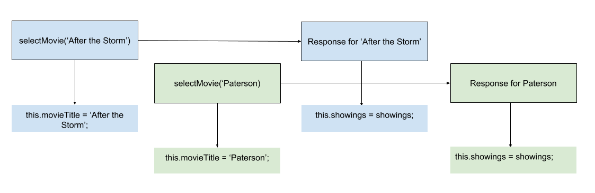
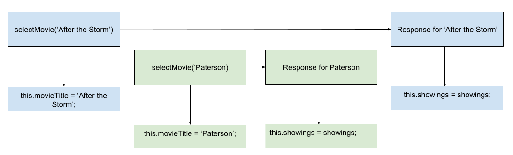
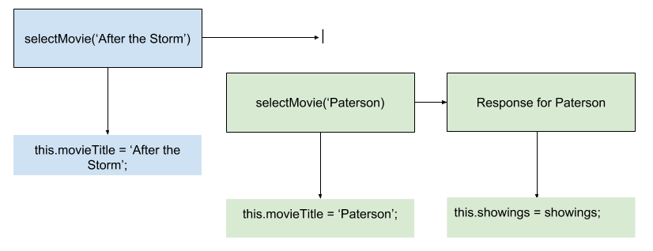
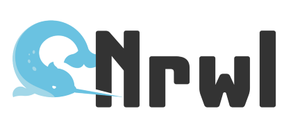

# [译] RxJS 进阶技巧: 使用 RxJS Marbles 测试竞争条件

> 原文链接: [https://blog.nrwl.io/rxjs-advanced-techniques-testing-race-conditions-using-rxjs-marbles-53e7e789fba5](https://blog.nrwl.io/rxjs-advanced-techniques-testing-race-conditions-using-rxjs-marbles-53e7e789fba5)

<p align="left">
  
</p>

_Victor Savkin 是 [nrwl.io](https://nrwl.io/) 的联合创始人。他之前在 Google 的 Angular 核心团队，并建立了依赖注入、变化检测、表单模块和路由模块。_

<hr />

构建 Web 应用涉及到多个后端、Web Workers 和 UI 组件，所有的这一切都会并发地更新应用的状态。由于竞争状态很容易引入 bug 。在本文中我会展示带有这样 bug 的示例，并教你如果在单元测试中使用 RxJS marbles 来暴露问题，以及最后如何来修复问题。

_我会使用 Angular 和 RxJS，但我将谈论的任何内容真的是适用于任何 Web 应用的，与使用的框架无关。_

## 问题

我们来看下 `MovieShowingsComponent` 。它是一个展示电影放映的简单组件。当用户选择一部电影时，组件会立即显示已选择的电影名称，然后，一旦从后端接收到响应，便会显示相应的 `showings` 。

```typescript
@Component({
  selector: 'movie-showings-component',
  templateUrl: './movie-showings.component.html'
})
export class MovieShowingsComponent {
  public movieTitle: string;
  public showings: string[];

  constructor(private backend: Backend) {}

  selectMovie(movieTitle: string) {
    this.movieTitle = movieTitle;

    this.backend.getShowings(movieTitle).subscribe(showings => {
      this.showings = showings;
    });
  }
}
```

**这个组件存在竞争条件**。为了看出问题所在，让我们想象如下场景。假设用户先选择了 ‘After the Storm’，然后再选择 ‘Paterson’ 。它看上去应该是这样的:



我们在这里做一个假设: ‘After the Storm’ 的响应会先返回。但如果不是这样呢？如果 ‘Paterson’ 的响应先返回会发生什么？



应用其实选的是 ‘Paterson’，但显示的是 `showings` 却是 ‘After the Storm’ 的，应用被破坏了。

在开始修复它之前，让我们来编写单元测试来暴露这种竞争条件。当然，有很多方法可以做到这点。但由于我们使用 RxJS，我们会用 Marbles ，它是一种测试并发代码的工具，它功能强大并且潜力十足。

## Marbles

要使用 Marble，我们需要安装 jasmine-marbles 库。

```shell
npm install — save-dev jasmine-marbles
```

在为组件编写测试之前，我们先通过测试 **concat** 操作符来看下 Marble 测试通常是如何工作的。

```typescript
import {cold, getTestScheduler} from 'jasmine-marbles';
import 'rxjs/add/operator/concat';

describe('Test', () => {
  it('concat', () => {
    const one$ = cold('x-x|');
    const two$ = cold('-y|');

    expect(one$.concat(two$)).toBeObservable(cold('x-x-y|'));
  });
});
```

这里我们使用由 _jasmine-marbles_ 提供的 `cold` 辅助方法创建了两个 observables: `one$` 和 `two$` 。(如果你对热的和冷的 observables 还不熟悉的话，请阅读 Ben Lesh 的[这篇文章](https://medium.com/@benlesh/hot-vs-cold-observables-f8094ed53339))。

接下来，我们使用 concat 操作符来获取结果 observable，它会用来与期待的结果进行比较。

**Marbles 是一种用来定义 RxJS observables 的领域特定语言**。使用它我们可以定义 observables 何时发出值，何时它们是空闲的，何时它们报错，何时它们被订阅，以及何时它们完成。在我们的测试中，我们定义了两个 observables，其中一个 (’x-x|’) 发出一个 ‘x’，然后等待10毫秒再发出另一个 ‘x’ ，然后完成。而另一个在发出 ‘y’ 前会等待10毫秒。

通常发出单个字母的字符串是不够的。`cold` 辅助函数提供了一种方式以将其映射成其他的对象，像这样:

```typescript
import {cold, getTestScheduler} from 'jasmine-marbles';
import 'rxjs/add/operator/concat';

describe('Test', () => {
  it('concat', () => {
    const one$ = cold('x-x|', {x: 'some value'});
    const two$ = cold('-y|', {y: 999});

    expect(one$.concat(two$)).toBeObservable(cold('a-a-b|', {a: 'some value', b: 999}));
  });
});
```

**与许多 DSL 一样，我们使用 Marbles 来提升我们测试代码的可读性。Marbles 在此方面做的非常棒，我们只要稍稍看一眼测试代码便能明白测试代码在做什么。**

如果你想了解有关 Marbles 测试的更多内容，请观看[这个视频](https://egghead.io/lessons/rxjs-introduction-to-rxjs-marble-testing)。

## 测试竞争条件

有了这个强力工具，我们来编写单元测试以暴露出竞争条件。

```typescript
import { MovieShowingsComponent } from './movie-showings.component';
import { cold, getTestScheduler } from 'jasmine-marbles';

describe('MovieShowingsComponent', () => {
  it('should not have a race condition', () => {
    const backend = jasmine.createSpyObj('backend', ['getShowings']);
    const cmp = new MovieShowingsComponent(backend);

    backend.getShowings.and.returnValue(cold('--x|', {x: ['10am']}));
    cmp.selectMovie('After the Storm');

    backend.getShowings.and.returnValue(cold('-y|', {y: ['11am']}));
    cmp.selectMovie('Paterson');

    // 这会清除所有的 observables
    getTestScheduler().flush();

    expect(cmp.movieTitle).toEqual('Paterson');
    expect(cmp.showings).toEqual(['11am']); // 这会失败，因为 showings 是 ['10am'] 。
  });
});
```

## 修复竞争条件

我们再来看下我们的组件。

```typescript
@Component({
  selector: 'movie-showings-component',
  templateUrl: './movie-showings.component.html'
})
export class MovieShowingsComponent {
  public movieTitle: string;
  public showings: string[];

  constructor(private backend: Backend) {}

  selectMovie(movieTitle: string) {
    this.movieTitle = movieTitle;

    this.backend.getShowings(movieTitle).subscribe(showings => {
      this.showings = showings;
    });
  }
}
```

每次用户选择一个电影，我们都创建一个新的孤立的 observable 。如果用户点击两次，我们就有两个 observables，它们之间无法协调。这才是问题的根源。

让我们通过引入一个所有 `getShowings` 调用的 observable 来改变现状。

```typescript
@Component({
  selector: 'movie-showings-cmp',
  templateUrl: './movie-showings.component.html'
})
export class MovieShowingsComponent {
  public movieTitle: string;
  public showings: string[];

  private getShowings = new Subject<string>();

  constructor(private backend: Backend) {
  }

  showShowings(movieTitle: string) {
    this.movieTitle = movieTitle;
    this.getShowings.next(movieTitle);
  }
}
```

接下来，我们将 observable 映射成 showings 列表。

```typescript
@Component({
  selector: 'movie-showings-cmp',
  templateUrl: './movie-showings.component.html'
})
export class MovieShowingsComponent {
  public movieTitle: string;
  public showings: string[];

  private getShowings = new Subject<string>();

  constructor(private backend: Backend) {
    this.getShowings.switchMap(movieTitle => this.backend.getShowings(movieTitle)).subscribe(showings => {
      this.showings = showings;
    });
  }

  showShowings(movieTitle: string) {
    this.movieTitle = movieTitle;
    this.getShowings.next(movieTitle);
  }
}
```

**通过这样，我们用单个的高阶 observable 来替代一组孤立的 observables 的集合，我们可以对它应用同步性的操作符**。同步性的操作符指的就是 **switchMap** 。

`switchMap` 操作符只会订阅 `backend.getShowings` 的最新调用。如果执行了另一个调用，它会取消对前一个调用的订阅。



随着这次变化，我们的测试将会通过。

## 源码

你可以在[这个仓库](https://github.com/vsavkin/marble_testing_and_race_conditions)找到源码。注意 `tsconfig.spec.json` 文件中的 "skipLibCheck": true 。

## 总结

在本文中，我们看过了一个由竞争条件引起的 bug 示例。我们使用了 Marbles， 这是一种测试异步代码的强大方法，以暴露单元测试中的 bug 。然后我们通过使用单个的高阶 observable (应用了 switchMap 操作符) 来重构代码以修复这个 bug 。

**Victor Savkin 是 [Nrwl — 企业级 Angular 咨询公司](https://nrwl.io/) 的联合创始人**。



_如果你喜欢的话，请点击下面的💚，这样其他人也会在 Medium 看到此篇文章。关注 [@victorsavkin](http://twitter.com/victorsavkin) 以阅读更多关于 Angular 的内容。_
