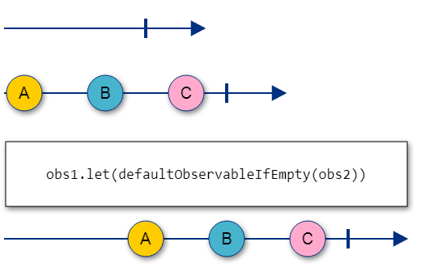
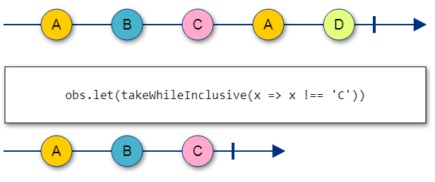

# [译] RxJS: multicast 操作符的秘密

> 原文链接: [https://blog.angularindepth.com/rxjs-multicasts-secret-760e1a2b176e](https://blog.angularindepth.com/rxjs-multicasts-secret-760e1a2b176e)


照片取自 [Unsplash](https://unsplash.com/)，作者 [Tim Mossholder](https://unsplash.com/photos/oTjFWTHDRZQ) 。

`multicast` 操作符有一个秘密。`publish` 操作符也是如此，它封装了 `multicast` 。这个秘密有时候真的挺好用的。

## 秘密

`multicast` 和 `publish` 的文档中都提到了 `ConnectableObservable` 。`ConnectableObservable` 是一种特殊类型的 observable，只有调用它的 `connect` 方法后，它才会开始向订阅者发送通知。然而，`multicast` 和 `publish` 操作符并非永远返回 `ConnectableObservable` 。

我们先来看下 `publish` 的[源码](https://github.com/ReactiveX/rxjs/blob/5.4.3/src/operator/publish.ts#L24-L27):

```ts
export function publish<T>(
  this: Observable<T>,
  selector?: (source: Observable<T>) => Observable<T>
): Observable<T> | ConnectableObservable<T> {
  return selector ?
    multicast.call(this, () => new Subject<T>(), selector) :
    multicast.call(this, new Subject<T>());
}
```

可以很清楚地看出，`publish` 只是对 `multicast` 进行了一层很薄的封装。它创建了 subject 并传给 `multicast`，还有一个可选的 `selector` 函数。最有趣的部分是在 `multicast` 实现之中，它包含[如下代码](https://github.com/ReactiveX/rxjs/blob/5.4.3/src/operator/multicast.ts#L42-L50):

```ts
if (typeof selector === 'function') {
  return this.lift(new MulticastOperator(subjectFactory, selector));
}

const connectable: any = Object.create(this, connectableObservableDescriptor);
connectable.source = this;
connectable.subjectFactory = subjectFactory;
return <ConnectableObservable<T>> connectable;
```

只有在不传入 `selector` 函数的情况下，`multicast` 才返回 `ConnectableObservable`。如果传入 `selector` 函数的话，会使用 [lift 机制](https://github.com/ReactiveX/rxjs/issues/60)来使得源 observable 创建出适当类型的 observable 。不需要在返回的 observable 上调用 `connect` 方法，并且在 `selector` 函数的作用域中会共享源 observable 。

这意味着 `multicast` (以及 `publish`) 操作符可以用来轻松实现源 observable 的本地共享。

## 使用 publish 进行本地共享

我们来看看使用 `publish` 的示例。

RxJS 引入了 `defaultIfEmpty` 操作符，它接收一个值，如果源 observable 为空的话，会将这个值发出。有时候，能够指定一个默认 observable 的话要比指定单个值有用得多，那么让我们来实现一个 `defaultObservableIfEmpty` 函数，它可以与 `let` 操作符一起使用。

下面的弹珠图展示了源 observable 为空时它的行为:



RxJS 引入了 `isEmpty` 操作符，当源 observable 完成时，它会发出布尔值以标识源 observable 是否为空。但是，要在 `defaultObservableIfEmpty` 实现中使用它的话，需要共享源 observable，因为需要发出值的通知，而 `isEmpty` 无法做到这点。`publish` 操作符使得源 observable 的共享变得简单，实现如下所示:

```ts
function defaultObservableIfEmpty<T>(
  defaultObservable: Observable<T>
): (source: Observable<T>) => Observable<T> {

  return source => source.publish(shared => shared.merge(
    shared.isEmpty().mergeMap(empty => empty ?
      defaultObservable :
      Observable.empty<T>()
    )
  ));
}
```

传给 `publish` 的 `selector` 函数接收共享的源 observable 。`selector` 返回的 observable 是由共享源 observable 和根据源 observable 是否为空得到的 observable (如果源 observable 为空，则为传入的默认 observable，否则为空 observable) 的组合而成。

源 observable 的共享完全是由 `publish` 管理的。使用 `selector` 函数，就能够根据需要多次订阅共享 observable，而不会影响源 observable 后面的订阅。

## 使用 multicast 进行本地共享

我们来看另一个示例，这次使用 `multicast` 。

RxJS 引入了 `takeWhile` 操作符，它返回的 observable 会发出源 observable 的值，直到不满足给定条件的值出现，此刻 observable 完成。不满足条件的那个值不会被发出。我们来实现一个 `takeWhileInclusive` 函数，它可以与 `let` 操作符一起使用。

下面的弹珠图展示了值不满足条件时的行为:



可以使用 `takeWhile` 操作符作为基础来实现，当不满足条件时，只需要再连接不满足条件的那个值即可。要在 `takeWhile` 返回的 observable 完成后取得这个值，可以使用 `ReplaySubject`:

```ts
function takeWhileInclusive<T>(
  predicate: (value: T) => boolean
): (source: Observable<T>) => Observable<T> {

  return source => source.multicast(
    () => new ReplaySubject<T>(1),
    shared => shared
      .takeWhile(predicate)
      .concat(shared.take(1).filter(t => !predicate(t)))
  );
}
```

这里使用了缓冲区大小为1的 `ReplaySubject` 来共享源 observable 。当 `takeWhile` 操作符返回的 observable 完成时，共享的 observable 是串联的，使用 `take(1)` 可以确保只考虑重放的值，而 `filter` 可以确保只有当不满足条件时才进行追加。

## 这种方式可靠吗？

RxJS 5 是相当新的库，它的文档扔在进行中，所以这种方式还没有在文档中出现，只是在内部使用。公开的 [TypeScript 签名](https://github.com/ReactiveX/rxjs/blob/5.4.3/src/operator/multicast.ts#L7-L10)指出了并非永远返回的是 `ConnectableObservable`，也有相对应的[单元测试](https://github.com/ReactiveX/rxjs/blob/5.4.3/spec/operators/multicast-spec.ts#L86-L144)。

RxJS 通常比较灵活，因此实现这些函数还有其他方式，但上面的示例说明了当需要本地共享源 observable 时，`publish` 和 `multicast` 简单易用，值得考虑。
